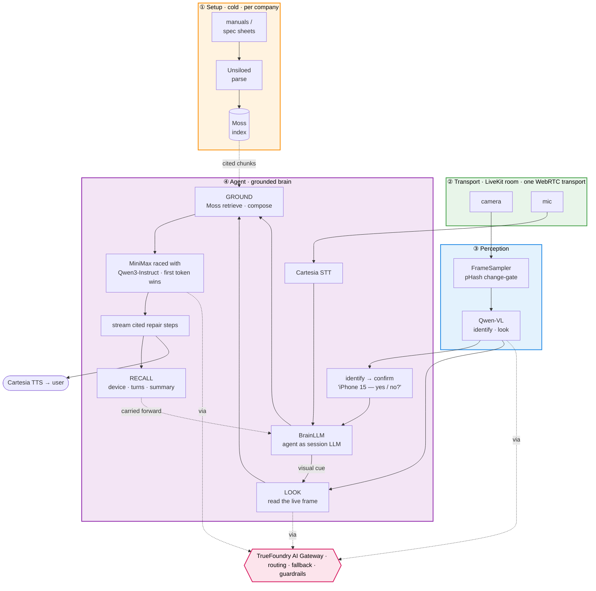
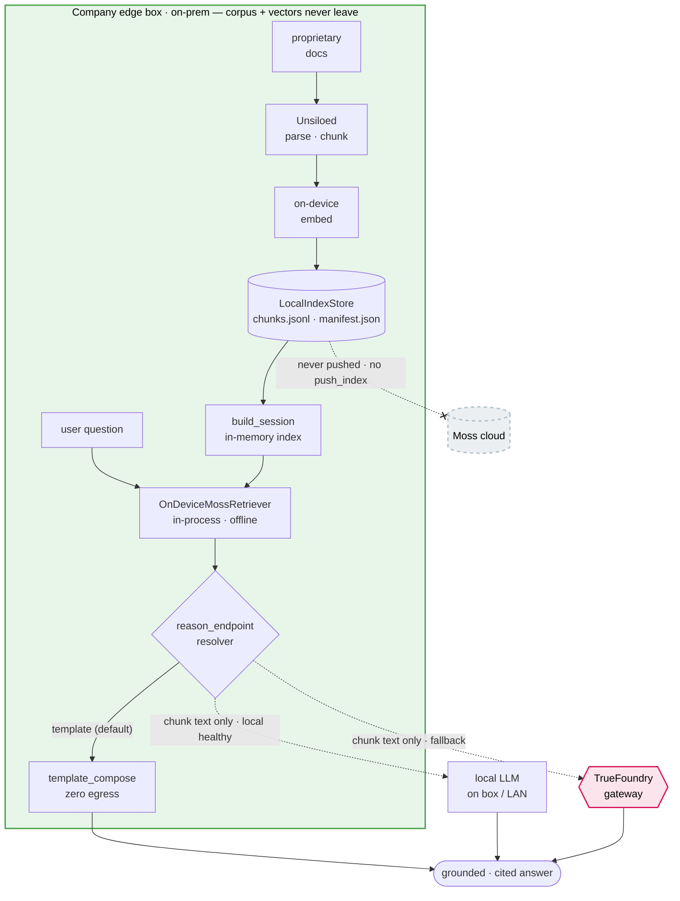

<div align="center">


# Clutch

### Live video support for hardware — an agent that *sees* the problem.

Software support got solved by chatbots; hardware didn't, because hardware problems are physical
and visual. Clutch embeds on a company's support page as a widget with three modes — **Type**,
**Talk**, **See** — backed by one brain that is grounded in the company's own documentation and, in
See mode, looks at the device through the live camera and talks the customer through the fix.

Conversational AI Hackathon · Moss × YC · Jun 6–7, 2026.

</div>

---

## Modes

| Mode | Surface | Path |
|---|---|---|
| **Type** | text chatbox | text → Moss retrieval (company-scoped) → grounded answer |
| **Talk** | live voice | STT → grounded answer → TTS, token-streamed |
| **See** | live camera | identify → confirm → look → grounded steps |

The brain is wired in as the LiveKit session's LLM, so a typed turn and a spoken turn resolve
through the same grounded path — Type and Talk differ only at the I/O surface.

---

## See mode — the live loop



The session subscribes a single WebRTC transport and demultiplexes it into two independent sinks:
audio to Cartesia STT and into the agent, video to a perceptual-hash–gated sampler and into
Qwen-VL. The agent runs a text LLM and never ingests the video track — vision is owned by the
sampler — so the two modalities stay on separate paths.

Identify proposes the device; the agent confirms before acting and re-identifies on rejection,
keyed by an anti-loop signature so it won't re-ask on an unchanged frame. Observational turns are
routed by cue to a `look()` call that hands the current frame to Qwen-VL; the agent voices the
observation, then retrieves and streams repair steps grounded on it — the observation feeds both
the retrieval query and the composer's context.

---

## The cold path

A one-time, self-serve onboarding off the live loop, per stage:

- **Parse** — uploaded manuals and spec sheets go through **Unsiloed**, which turns mixed-format docs
  into clean text.
- **Chunk** — the text is split into passages carrying `{source, section, page}` metadata, so every
  later answer can cite exactly where it came from.
- **Index** — passages are embedded and indexed in **Moss** for real-time semantic retrieval.
- **Catalog** — the same pass derives a closed-set product catalog (one entry per product) — what See
  mode classifies the device against at runtime.
- **Embed** — onboarding emits a one-line widget snippet; dropping it on the support page is the whole
  integration.
- **Re-index** — admin-triggered and incremental: only changed documents are re-embedded, so the live
  index is never rebuilt from scratch.

---

## The hot path

First audio inside the conversational budget, per layer:

- **Reasoning** — the primary model (MiniMax, the smarter answer) and a fast instruct model (Qwen3)
  start in parallel at `t=0`; the agent streams from whichever returns the first token and cancels
  the other. MiniMax is usually the faster of the two, so it normally wins outright — but when its
  hosting is overloaded its first-token latency spikes, and on those turns the race quietly falls
  through to Qwen3 instead of stalling. The moment the overload clears, MiniMax starts winning the
  race again on its own: the system re-promotes the smarter model with no flag, restart, or manual
  switch.
- **Output** — answer tokens are forwarded as deltas the moment they arrive; TTS speaks on the
  first word rather than the first sentence.
- **Retrieval** — the Moss index is warmed at startup; warm reads land in single-digit-to-low-tens
  of milliseconds.
- **Vision** — the frame sampler fires Qwen only on a pHash change past threshold, so a held-still
  device draws no calls; best-frame selection runs within the burst.
- **Turn-taking** — endpointing is tuned tight so turn-end is detected sooner.
- **See** — the observation is spoken ahead of the (slower) grounded steps it precedes.

---

## Recall

Per-session memory feeds every turn: a verbatim window of recent turns (both roles) as chat
context; a rolling summary that folds older turns once the window overflows, keeping the tail and
both roles so the agent retains what it itself said; and the confirmed device pinned ahead of the
summary so it survives folding across a long call.

---

## Seams

Each layer takes its cross-layer dependencies as injected callables and imports no sibling
subfolder — perception names no vision vendor, retrieval names no LLM vendor, the realtime layer
holds the agent and calls only its methods. `src/app.py` is the single composition root; swapping
the entire stack from live providers to mocks (the test path) changes only what it injects.

| Seam | Boundary |
|---|---|
| **S2** | Realtime ⇄ Agent — `on_user_turn` / `stream_turn` / `on_identify` |
| **S3** | Agent ⇄ Perception — `identify(frames, catalog)` / `look(frames, question)` |
| **S4** | Agent ⇄ Retrieval — `retrieve(query)` / `compose(query, chunks)` |
| **S5** | Everything ⇄ TrueFoundry gateway — OpenAI-compatible client, logical model names |
| **S8** | Realtime ⇒ Perception — the FrameSampler frame feed |

Reasoning and vision both route through the gateway by logical name, so the model behind any seam
is a config value.

---

## Stack

| Layer | Technology |
|---|---|
| Chat / voice / live-video transport + embeddable widget | **LiveKit** |
| Reasoning brain (all modes) | **MiniMax** raced with **Qwen3-Instruct** — via gateway |
| Visual understanding — closed-set **identify** and free-form **VQA** | **Qwen-VL** — via gateway |
| Voice I/O (STT + TTS) | **Cartesia** (LiveKit plugins) |
| Manual / spec-sheet parsing | **Unsiloed** |
| Real-time semantic retrieval over the company corpus | **Moss** (host) |
| Model routing + agent governance / guardrails | **TrueFoundry** AI Gateway |

---

## Two flows

**Setup (cold, self-serve).** `log in → upload manuals → Unsiloed parses → Moss indexes → derive a
per-company product catalog → one embed snippet.`

**Session (hot, in the widget).** `open widget → Type/Talk (company-scoped retrieval) or See
(identify + confirm → look → company+product retrieval) → grounded fix over LiveKit.`

---

## Layout

| Path | What it is |
|---|---|
| [`src/agent/`](src/agent/README.md) | **Conversation Agent** — routing FSM, See VQA + grounding, recall, safety/escalation. |
| [`src/perception/`](src/perception/README.md) | **Vision** — `identify()` and `look()` via Qwen-VL; pHash best-frame selection. |
| [`src/retrieval/`](src/retrieval/README.md) | **Retrieval & grounding** — Moss read path + cited and streaming composers. |
| [`src/realtime/`](src/realtime/README.md) | **Realtime/voice server** — LiveKit session, brain↔LLM bridge, FrameSampler, event publisher. |
| [`src/speech/`](src/speech/README.md) | **Speech adapters** — Cartesia STT/TTS swap point. |
| [`src/api/`](src/api/README.md) · [`src/onboarding/`](src/onboarding/README.md) | **Backend + onboarding** — corpus ingest, catalog, tenancy. |
| `src/app.py` | **Composition root** — injects every dependency across the seams. |
| [`ondevice/`](ondevice/README.md) | **On-prem edge retrieval** — isolated reference build of the on-device backend; imports nothing from `src/`. |
| `moss-hacker-starter/frontend/` | The **widget frontend** (Next.js + LiveKit Agents UI). |
| `scripts/` | `run_clutch.py` (worker), `seed_*.py` (demo corpora), diagnostic + e2e harnesses. |
| `tests/` | 66 unit + integration tests — agent, perception, app wiring, speech, retrieval. |

---

## Running it

```bash
# Backend worker (creds in .env / .env.local)
uv run --group voice --group retrieval python scripts/run_clutch.py --check   # verify wiring
uv run --group voice --group retrieval python scripts/run_clutch.py start      # run

# Seed a demo corpus
uv run --group retrieval python scripts/seed_iphone.py

# Frontend widget
cd moss-hacker-starter/frontend && pnpm install && pnpm dev   # localhost:3000 → allow mic + camera

# Tests
uv run python -m pytest tests/ -q
```

| Var | For |
|---|---|
| `LIVEKIT_URL`, `LIVEKIT_API_KEY`, `LIVEKIT_API_SECRET` | realtime transport |
| `CARTESIA_API_KEY` | STT / TTS |
| `TRUEFOUNDRY_BASE_URL`, `TRUEFOUNDRY_API_KEY` | model routing (reasoning + vision) |
| `VISION_MODEL`, `REASON_MODEL`, `REASON_FAST_MODEL` | gateway model ids (Qwen-VL · MiniMax · fast instruct) |
| `MOSS_PROJECT_ID`, `MOSS_PROJECT_KEY`, `MOSS_BASE_URL` | retrieval |
| `AGENT_NAME` | explicit LiveKit dispatch name (the frontend dispatches by this) |

The frontend mints a token carrying room metadata `{company_key, modality}` and dispatches the
worker by `AGENT_NAME` (`agent-py`); See is the demo default.

---

## Team

| Section | Owner | Scope |
|---|---|---|
| **Cognition** | Tonmoy | Perception (02) + Agent (04) |
| **Inference** | Fardin | Retrieval (03) + Realtime/Speech (05) |
| **Platform** | Arham | Backend/onboarding (01) + gateway/tenancy |
| **Frontend** | Arman | The embeddable widget |

---

## On-device retrieval — built, available for the enterprise / compliance tier

For tenants whose corpus is proprietary or regulated, retrieval runs **entirely on a company-owned
edge box** — **built and tested** as an isolated package in [`ondevice/`](ondevice/README.md), and
available for any deployment that needs it. The
documents and their Moss embeddings are built and held on that box and **never pushed to the cloud**;
at query time, embedding and search run **in-process and offline**. The only corpus-derived egress is
the retrieved top-k chunk *text* sent for compose — and that goes to a **local LLM when one is
configured and healthy, else the cloud gateway**, or to a deterministic offline composer for **zero
egress**. The grounding guarantee (cited chunks, refuse-rather-than-invent) holds identically on the
local backend.

It's a **variant backend, not a fork.** On-device sits behind the same `Retriever` seam (S4) as the
cloud and fallback backends; selection is a **config-keyed registry lookup**, so the path is a data
value on the `Company` record, not branch code. Every caller — Agent, realtime, widget — is unchanged,
and a tenant can start on cloud and flip to on-prem later by re-onboarding, with nothing downstream
touched. *(Realtime transport, voice, and vision stay API-routed in this design; the confidentiality
guarantee covers the document corpus.)*



---

## Glossary
- **See mode** — identify → confirm → look → grounded fix.
- **identify** — closed-set: which catalog product this is + visible problem signals.
- **look (VQA)** — free-form: answer the customer's question from the live frame.
- **Grounding** — answers composed from retrieved, cited company-doc chunks; never invented.
- **Recall** — per-call memory the brain carries (recent turns + rolling summary + pinned device).
- **Model race** — parallel reasoning models, stream from the first to return a token.
- **Knowledge Matches** — the live panel of doc chunks (and scores) that grounded each turn.
