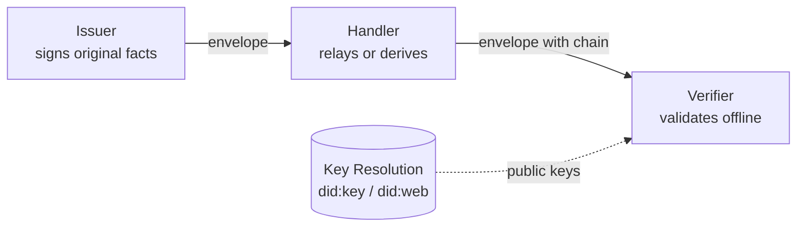
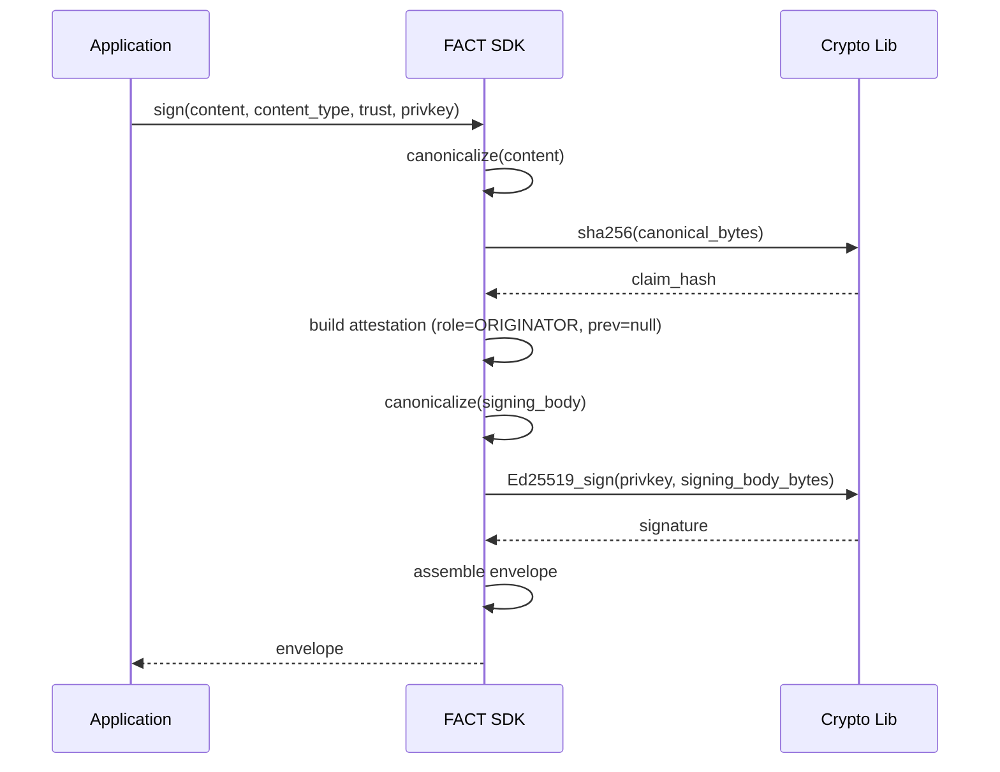
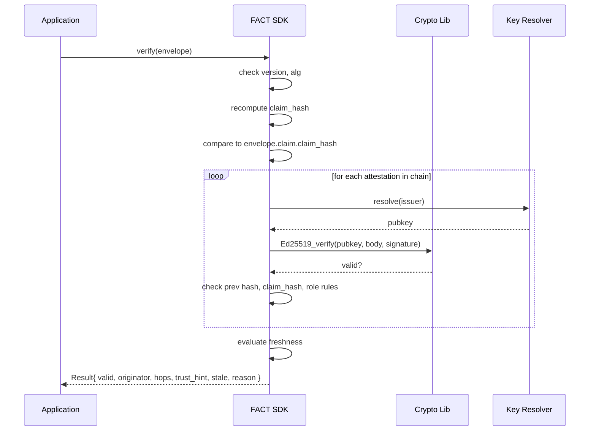

# FACT Protocol

## Facts, Attested, Chained, Transferable

## High-Level Design — v0.2

**Status:** Draft (hardened)
**Scope:** Protocol layer only — envelope structure, sign/verify, chain-of-custody, identity, key rotation, replay protection, version interop. Issuer infrastructure, corpus pipeline, and product surface are out of scope for this document.
**Changes from v0.1:** Replay protection, explicit key rotation, clock-skew handling, algorithm agility, cross-version interop, explicit signing body, canonicalization gotchas, DoS limits, explicit unknown-field rule. See §14 (Changelog).

---

## 1. Purpose

FACT defines how a fact about the world travels between independent parties — typically autonomous agents — in a form the receiver can verify offline, with no callback to the issuer or any central authority.

The protocol answers one question, with cryptography rather than trust in a channel:

> Given a fact I just received, can I prove it was issued by who it claims, has not been altered, and is recent enough to act on — using only the bytes in front of me and a public key I already have?

Everything in this document exists to make that question answerable in milliseconds, deterministically, by any conformant implementation.

---

## 2. Design Principles

These are the non-negotiable properties. Every later decision is downstream of them.

**Offline verification is mandatory.** A verifier must be able to fully validate an envelope using only its bytes plus the issuer's public key. No network call is required at verification time. This is what distinguishes the protocol from a vendor API.

**Integrity is recomputed, never trusted.** The verifier hashes the claim itself and compares to the asserted hash. No field in the envelope is taken on faith — every claim is checked against the math.

**Identity is decentralized.** Anyone with a keypair can issue. The protocol does not require a central registry of permitted issuers. Whether a given issuer is _trusted_ is a policy decision the receiver makes, separate from protocol-level validity.

**The protocol is content-agnostic.** FACT never inspects the payload. A property record, a permit, a medical observation, a sensor reading — all opaque bytes to the protocol. Domain semantics live in external content-type registries.

**Trust hints are advisory, not load-bearing.** The issuer may attach a recommendation (act / verify / escalate). The verifier returns it to the caller. The receiver decides what to do. A malicious issuer cannot grant itself authority by asserting a strong trust hint, because the receiver is not bound by it.

**Provenance survives multi-hop.** Facts move between agents; the protocol must preserve who originated, who relayed, and who derived, across an arbitrary chain.

---

## 3. System Overview

The protocol has three roles. Any real party can play one or more.



**Issuer.** Holds a private key. Asserts that a fact came from a real-world source and signs an envelope binding the fact to that assertion.

**Handler.** Receives an envelope, optionally adds its own signed attestation (relay or processor), and forwards. A handler does not need to trust the previous handler — it verifies before re-signing.

**Verifier.** Receives an envelope, walks the chain, validates all signatures and hashes locally, returns a structured result. The verifier is the entity making a decision; it might be embedded in an agent, a backend service, or an audit tool.

Note that there is no central server in this diagram. Key resolution is the only place the verifier touches anything outside the envelope, and even that is cacheable and can be eliminated entirely if `did:key` identifiers are used.

---

## 4. Data Model

### 4.1 The Envelope

The envelope is the unit that travels on the wire.

```
Envelope {
  v       : string         // protocol version, e.g. "fact/0.2"
  alg     : string         // crypto + canonicalization suite, e.g. "ed25519-sha256-jcs"
  nonce   : string         // 128-bit random value, b64url; uniquely identifies this envelope
  claim   : Claim          // the fact being attested
  chain   : Attestation[]  // ordered: originator → ... → last handler; MAX 16 hops
  trust   : Trust          // issuer's advisory metadata
}
```

**`nonce`** is a 128-bit cryptographically random value, base64url-encoded, generated by the originator and unchanged through the chain. It is part of every signed body in the chain (see §4.3), so it cannot be modified without breaking signatures. The nonce serves two purposes: it gives the envelope a globally-unique ID for replay detection (§4.7), and it binds the chain to a single envelope instance (the same claim signed twice produces two distinct envelopes).

**Chain length** is capped at 16 hops to bound verifier work and prevent chain-amplification DoS. A verifier MUST reject envelopes with longer chains. Real workflows almost never exceed 3-4 hops; 16 is generous.

### 4.2 The Claim

```
Claim {
  content      : object | bytes   // the fact itself, opaque to the protocol; MAX 1 MiB
  content_type : URI              // points to an external type registry
  claim_hash   : string           // b64url(sha256(canonicalize(content)))
}
```

The `content_type` is a URI that names the schema of `content` — e.g. `fact://types/code_enforcement/violation`. The protocol references this for routing and tooling but never parses `content` itself.

`claim_hash` is _derived_, not authored. The issuer computes it; the verifier recomputes it; if they disagree, the envelope is rejected. The hash is the fact's canonical identity — two issuers signing the same fact will produce the same `claim_hash`, which enables independent corroboration.

**Content size** is capped at 1 MiB (1,048,576 bytes) after canonicalization. Verifiers MUST reject larger claims. This limit can be raised in future versions; v0.2 picks 1 MiB as comfortably above realistic fact sizes (typical facts are <10 KiB) while preventing memory-exhaustion attacks.

### 4.3 The Attestation

```
Attestation {
  issuer      : string              // identity that resolves to a public key
  key_id      : string              // identifier of the specific key used (for rotation, §7.4)
  role        : ORIGINATOR | RELAY | PROCESSOR
  asserts     : string              // "true_as_of" | "extracted_from" | "relayed_unchanged" | "derives_from"
  issued_at   : RFC3339             // UTC timestamp, MUST include timezone (typically "Z")
  prev        : string | null       // b64url(sha256(canonicalize(previous_attestation))), null for first link
  derives_from: string | null       // claim_hash of the source fact (PROCESSOR only)
  claim_hash  : string              // MUST match envelope.claim.claim_hash
  nonce       : string              // MUST match envelope.nonce
  evidence    : object              // optional: { source_uri, original_hash, method, ... }
  ext         : object              // optional: extension fields (see §4.6, §11)
  signature   : string              // b64url(Ed25519_sign(privkey, canonicalize(signing_body)))
}
```

**The signing body is defined explicitly as the attestation with the `signature` field omitted entirely.** That is:

```
signing_body = {
  issuer, key_id, role, asserts, issued_at, prev,
  derives_from, claim_hash, nonce, evidence, ext
}
```

Every other field of the attestation is in the signed body — no exceptions, no optional inclusions. The `ext` block (§4.6) is included in the signature even though verifiers may not understand its contents. This is what makes the "must-ignore-unknown" rule (§11) safe: unknown fields are signed, so an attacker cannot inject or modify them.

The signature covers the issuer, key_id, role, assertion, timestamp, chain back-reference, derivation pointer, claim hash, nonce, evidence, extensions, _and_ (implicitly via `prev` in non-first links) the position in the chain.

This binding is what makes the chain tamper-evident. You cannot:

- Lift a signature off one attestation and reuse it elsewhere (the body would differ)
- Reorder the chain (each `prev` hash pins position)
- Splice in a forged link (the signature would not verify against the claimed issuer's key)
- Change the claim and keep the signatures (the `claim_hash` field is part of the signed body)
- Replay an envelope into a new envelope (the `nonce` differs and is signed)
- Modify "unknown" extension fields (they are part of the signed body)

### 4.4 The Trust Block

```
Trust {
  actionability : ACT | VERIFY | ESCALATE
  coverage      : float            // 0.0-1.0, issuer's confidence
  fresh_until   : RFC3339 | null   // after this, treat as stale; MUST include timezone
  not_before    : RFC3339 | null   // optional; envelope not valid before this time
  reason        : string           // human-readable note
}
```

This is the issuer's opinion on how the fact should be used. The verifier returns it to the caller; the caller decides. A receiver that distrusts a particular issuer will ignore this block entirely.

The `not_before` field, when present, allows an issuer to sign an envelope that becomes valid in the future (useful for scheduled disclosures or pre-signed credentials). Verifiers MUST reject envelopes presented before `not_before`. Most envelopes will omit it.

All timestamps in FACT include explicit timezone offsets. Timestamps without offsets MUST be rejected as MALFORMED — naive timestamps are a known source of cross-implementation bugs.

### 4.5 Roles, in detail

**ORIGINATOR.** The first link in the chain. Asserts that the fact derives from a real-world source the issuer is vouching for. `prev` is `null`. `evidence` typically includes `source_uri` and `method` (e.g. extraction technique).

**RELAY.** A handler forwarding the envelope without modifying the claim. The `claim_hash` in the attestation matches the envelope's claim. A relay is asserting "I received this from the previous signer, I'm forwarding it unchanged." Relays are useful for audit trails — they record who handled the fact even if they didn't modify it.

**PROCESSOR.** A handler that _transformed_ the original claim into a new one (summarized, filtered, derived an aggregate). The processor creates a _new envelope_ with a _new claim_ and a _new claim_hash_. The processor's attestation includes `derives_from` pointing to the original claim's hash, and `evidence` describing the transformation. The receiver can walk derivations backward to ground truth.

This role distinction is the structurally novel part of the protocol — most existing provenance schemes don't cleanly model transformation across independent handlers.

### 4.6 Extensions (`ext`)

Both the Attestation and the Trust block support an optional `ext` field — a JSON object for future or domain-specific metadata. Extensions are namespaced by URI keys:

```
"ext": {
  "https://example.com/medical/v1": { ... },
  "https://example.com/audit/v2":   { ... }
}
```

Verifiers MUST ignore extensions they do not recognize, but MUST include them in canonicalization for signature verification. This makes "must-ignore-unknown" safe — unknown fields cannot be tampered with because they are part of the signed body.

Implementations MAY surface unknown extensions to the application layer for inspection, but MUST NOT change protocol behavior based on them.

### 4.7 Replay Protection

The `nonce` field gives each envelope a globally-unique 128-bit identifier. The protocol provides the _mechanism_ for replay detection; receivers implement the _policy_.

**Mechanism.** Every envelope's nonce is signed (it appears in every attestation's signing body). Re-signing or modifying the nonce breaks all signatures. The nonce is therefore a tamper-evident envelope ID.

**Policy.** Replay detection is the receiver's responsibility. A receiver SHOULD maintain a bounded cache of recently-seen nonces (typical: last 24 hours, evict oldest first) and reject envelopes whose nonce it has already processed within the freshness window. The cache size and retention is a receiver policy, not a protocol parameter.

A receiver that does not care about replay (e.g., an audit logger that wants to ingest every copy) MAY skip nonce tracking. The protocol does not mandate replay detection; it makes it possible.

**Why this is sufficient.** The nonce, combined with `fresh_until`, bounds replay risk: an attacker who captures an envelope can re-present it only until `fresh_until`, and only to receivers that haven't already seen its nonce. Issuers should choose `fresh_until` windows appropriate to the sensitivity of the fact.

---

## 5. Wire Format and Canonicalization

### 5.1 Serialization

Envelopes are serialized as JSON, transmitted as UTF-8 bytes.

### 5.2 Canonicalization

All hashing and signing operates on bytes produced by **JCS (JSON Canonicalization Scheme), RFC 8785**:

- Object keys sorted lexicographically by UTF-16 code units
- No insignificant whitespace
- Numbers in shortest round-trip form per RFC 8785 §3.2.2.3
- Strings UTF-8, callers responsible for prior Unicode NFC normalization
- No trailing newline

JCS produces exactly one byte sequence for any given JSON value. Two conformant implementations MUST agree byte-for-byte on canonicalization output. Disagreement here breaks the entire protocol, silently — this is the single highest-risk implementation surface and the strongest argument for using a vetted library rather than rolling your own.

### 5.3 Canonicalization Gotchas (Implementer Notes)

JCS resolves most ambiguities but the following points bite implementations in practice. Implementers MUST handle each correctly; the conformance suite (§12) includes test vectors for all of them.

**Unicode normalization.** JCS does NOT normalize strings — it serializes whatever code points are present. Two strings that look identical but differ in normalization form (e.g., precomposed `é` vs decomposed `e + ◌́`) produce different bytes and different hashes. **Callers MUST apply Unicode NFC normalization before passing strings to the canonicalizer.** This is a caller responsibility, not the canonicalizer's job, and it is the single most common cause of "same data, different hash" bugs.

**Number representation.** JCS §3.2.2.3 defines shortest round-trip form. In practice: integers are emitted without a decimal point or exponent; non-integers use the shortest decimal that round-trips through IEEE 754. `1` and `1.0` canonicalize to different bytes (the first is `1`, the second is `1`). Negative zero (`-0`) canonicalizes to `0`. NaN and Infinity are not valid JSON and MUST be rejected before canonicalization.

**Repeated keys.** JSON allows duplicate object keys; JCS does not. Implementations MUST reject objects with duplicate keys at canonicalization time. Silently keeping the last value (a common parser default) is a security bug.

**Null vs absent.** `{"a": null}` and `{}` canonicalize to different bytes. The protocol treats absent fields and explicit nulls as semantically distinct — an attestation with `derives_from: null` is different from one omitting `derives_from`. Spec defaults: optional fields, when absent, are omitted entirely rather than set to null.

**Empty containers.** `[]` and `{}` are valid and canonicalize to themselves. They are distinct from absent fields.

**Field order.** JCS sorts object keys by UTF-16 code unit ordering. Arrays preserve their input order — array element order is semantically meaningful and MUST NOT be re-sorted.

**Byte-Order Mark.** The canonicalized output MUST NOT include a UTF-8 BOM. Implementations that emit BOM by default (some Windows libraries) MUST be configured to suppress it.

### 5.4 Frozen Bytes Pattern (Implementation Note)

In practice, the issuer canonicalizes once at sign time, and _those exact bytes_ travel with the envelope. The verifier hashes the bytes it received; it does not re-parse and re-serialize the claim before hashing. This sidesteps canonicalization fragility in the verify path — the verifier only needs JCS if it independently constructs a claim.

This is the same pattern JWT uses: the signed payload is the base64-encoded bytes, and verification works over those bytes directly.

The frozen-bytes approach is RECOMMENDED for production implementations. The conformance suite tests both patterns (frozen bytes and re-canonicalize) and both MUST yield identical results when implementations are correct.

---

## 6. Cryptographic Suite

### 6.1 Defined Suites

Identified by the `alg` field on the envelope. v0.2 defines one mandatory suite and reserves identifiers for future ones.

| Identifier              | Hash    | Signature                            | Canonicalization | Status        |
| ----------------------- | ------- | ------------------------------------ | ---------------- | ------------- |
| `ed25519-sha256-jcs`    | SHA-256 | Ed25519 (RFC 8032)                   | JCS (RFC 8785)   | **MANDATORY** |
| `ed448-sha512-jcs`      | SHA-512 | Ed448 (RFC 8032)                     | JCS (RFC 8785)   | Reserved      |
| `ecdsa-p256-sha256-jcs` | SHA-256 | ECDSA P-256 deterministic (RFC 6979) | JCS (RFC 8785)   | Reserved      |
| `mldsa44-sha256-jcs`    | SHA-256 | ML-DSA-44 (post-quantum, FIPS 204)   | JCS (RFC 8785)   | Reserved      |

All wire-encoded values (hashes, signatures, keys) use base64url without padding.

### 6.2 Rationale

- **Ed25519** is fast, deterministic (no nonce risk), produces small (64-byte) signatures, and is supported by every modern crypto library. ECDSA P-256 was considered and rejected as the default because non-deterministic signing leaks keys when implementations have bad randomness — but it is reserved for environments that require NIST curves.
- **SHA-256** is universal and overwhelmingly available in hardware. SHA-512 is reserved for paired use with Ed448.
- **JCS** is an IETF standard with multiple language implementations and clear semantics.
- **ML-DSA** (Module-Lattice Digital Signature Algorithm, formerly Dilithium) is reserved to give the protocol a defined post-quantum migration path. Activation is deferred until library support stabilizes.

### 6.3 Algorithm Agility

The `alg` field allows the protocol to migrate cryptographic primitives without breaking the envelope structure. Rules:

**Verifier behavior.** A verifier MUST reject envelopes whose `alg` it does not implement, with reason `UNSUPPORTED_ALG`. Silent fallback to a different suite is FORBIDDEN — it would create downgrade attacks.

**Mixed chains.** Each attestation in a chain MAY use a different `alg` (recorded in the envelope's top-level `alg` field for the originator, and per-attestation in future versions). v0.2 requires all attestations in a single envelope to use the same suite; mixed-suite chains are reserved for v0.3 with explicit per-attestation `alg`.

**Issuer migration.** An issuer rotating to a new suite SHOULD issue new envelopes under the new suite while honoring verification of envelopes signed under the old suite for as long as those envelopes remain within their freshness windows.

**Suite deprecation.** When a suite is deprecated (e.g., a primitive is found broken), the protocol governance publishes a deprecation notice with a sunset date. Verifiers SHOULD warn on deprecated suites and MAY reject them after sunset. The mechanism is policy, not protocol — the spec defines the registry and the procedure, not the timing.

---

## 7. Identity Resolution

The verifier needs the issuer's public key to check a signature. Two resolution modes are supported.

### 7.1 did:key (Fully Offline)

The issuer's identifier _contains_ the public key, encoded per the [did:key spec](https://w3c-ccg.github.io/did-method-key/). The verifier decodes the key directly from the identifier; no network is required.

Example: `did:key:z6MkhaXgBZDvotDkL5257faiztiGiC2QtKLGpbnnEGta2doK`

This mode MUST be supported by every conformant verifier.

### 7.2 did:web (Cached Resolution)

The issuer's identifier names a domain; the public key is fetched from a well-known location at that domain. The verifier resolves once and caches the key.

Example: `did:web:skope.io` resolves to `https://skope.io/.well-known/did.json`

This mode MAY be supported. Verifiers using it MUST cache, and MUST function in fully offline mode for previously-resolved identities.

### 7.3 Key Rotation

Issuers must be able to rotate signing keys without invalidating historical envelopes. FACT supports this through versioned keys and a published key history.

**Key identifiers.** Every attestation includes a `key_id` field naming the specific key used. The combination of `issuer + key_id` uniquely identifies one keypair instance. Common patterns:

- For `did:key`: the identifier IS the key, so `key_id` is the suffix after the method prefix.
- For `did:web`: the issuer publishes a key document at the well-known URL containing a list of keys with their `key_id`, `public_key`, `valid_from`, and `valid_until` timestamps.

**Verification across rotation.** A verifier presented with an envelope signed under a rotated-out key resolves the issuer's key document, finds the historical entry matching `key_id`, and validates the signature against that key. The verifier MAY additionally check that the attestation's `issued_at` falls within the key's `valid_from`/`valid_until` window; signatures dated after `valid_until` MUST be rejected.

**Compromised key handling.** If an issuer's key is compromised, the issuer publishes a _revocation entry_ in the key document: `{ key_id, revoked_at, reason }`. Verifiers MUST reject signatures dated at-or-after `revoked_at` for revoked keys. Signatures dated before `revoked_at` remain valid — past attestations are not retroactively invalidated unless the issuer explicitly says so (`revoked_retroactive: true`).

**Live revocation.** Strictly offline verifiers cannot consult a key document and therefore cannot know about post-issuance revocations. Two mitigations:

1. **Short freshness windows.** Issuers set `fresh_until` conservatively (hours to days, not weeks), bounding the blast radius of a compromised key.
2. **Optional online check.** Verifiers MAY consult the issuer's key document on a cached basis (e.g., refresh every N hours) to learn of revocations. This trades full offline operation for revocation awareness; it is the receiver's policy decision.

Future versions may add transparency-log-backed revocation (similar to Certificate Transparency) for stronger guarantees without re-introducing a central trust authority.

### 7.4 Clock Skew

The protocol uses absolute timestamps (`issued_at`, `fresh_until`, `not_before`, `valid_from`, `valid_until`). Real-world clocks drift. Verifiers MUST tolerate clock skew per these rules:

- **Default tolerance:** ±5 minutes. Implementations MUST accept envelopes whose `issued_at` is within 5 minutes of the verifier's current time, even if `issued_at` is slightly in the future.
- **Configurable tolerance:** Verifiers MAY tighten or loosen this for specific deployments; the protocol specifies a default but does not mandate a fixed value.
- **`fresh_until` enforcement:** An envelope is stale when `now > fresh_until + tolerance`. The verifier returns `stale: true` in the result; the receiver decides what to do.
- **`not_before` enforcement:** An envelope is not-yet-valid when `now < not_before - tolerance`. The verifier returns INVALID with reason `NOT_YET_VALID`.

Verifiers SHOULD log clock skew observations and warn when consistently observing large skews — they often indicate misconfigured issuer clocks, not malicious activity.

### 7.5 What's Deliberately Not Here

There is no Skope registry of permitted issuers. There is no central PKI. There is no chain of certificate authorities. Identity is self-sovereign at the protocol level. Trust in issuers — whether a given key is _worth_ believing — is a separate policy layer the receiver applies on top of cryptographic validity.

---

## 8. Operations

### 8.1 Signing (Originator)



Pseudocode:

```
sign_originator(content, content_type, trust, privkey) -> Envelope:
    canonical    = JCS(content)
    claim_hash   = b64url(sha256(canonical))
    claim        = Claim{ content, content_type, claim_hash }
    nonce        = b64url(random_bytes(16))   // 128 bits

    body = {
        issuer:       pubkey_id(privkey),
        key_id:       key_id_of(privkey),
        role:         ORIGINATOR,
        asserts:      "true_as_of",
        issued_at:    now_with_timezone(),
        prev:         null,
        derives_from: null,
        claim_hash:   claim_hash,
        nonce:        nonce,
        evidence:     { source_uri, method, ... },
        ext:          {}
    }
    signature = b64url(Ed25519_sign(privkey, JCS(body)))
    attestation = body + { signature }

    return Envelope{
        v:     "fact/0.2",
        alg:   "ed25519-sha256-jcs",
        nonce: nonce,
        claim: claim,
        chain: [attestation],
        trust: trust
    }
```

### 8.2 Appending (Relay or Processor)

A handler that has received and validated an envelope can append its own attestation.

For a **relay**, the claim is unchanged; the new attestation's `claim_hash` matches the envelope's claim hash, and `derives_from` is null.

For a **processor**, the handler creates a _new envelope_ with a _new claim_ (the transformed fact). The new originator-equivalent attestation has `role=PROCESSOR`, `asserts="derives_from"`, and `derives_from` set to the original claim's hash. The original envelope's chain may be referenced via `evidence` or carried alongside, depending on receiver needs.

Pseudocode for relay:

```
append_relay(envelope, privkey) -> Envelope:
    // Caller MUST have verified the envelope before appending
    prev_hash = b64url(sha256(JCS(envelope.chain[-1])))

    body = {
        issuer:       pubkey_id(privkey),
        key_id:       key_id_of(privkey),
        role:         RELAY,
        asserts:      "relayed_unchanged",
        issued_at:    now_with_timezone(),
        prev:         prev_hash,
        derives_from: null,
        claim_hash:   envelope.claim.claim_hash,
        nonce:        envelope.nonce,
        evidence:     {},
        ext:          {}
    }
    signature = b64url(Ed25519_sign(privkey, JCS(body)))

    return envelope with chain += [body + { signature }]
```

### 8.3 Verification



Pseudocode:

```
verify(envelope, now, options) -> Result:
    // options: { trusted_issuers?, skew_tolerance=300s, seen_nonce_cache?, size_limits }

    // 1. Static limits (DoS protection — check first, before any crypto)
    if size(envelope) > options.size_limits.envelope_max:
        return INVALID(SIZE_LIMIT_EXCEEDED)
    if size(envelope.claim.content) > options.size_limits.claim_max:
        return INVALID(SIZE_LIMIT_EXCEEDED)
    if len(envelope.chain) > 16:
        return INVALID(CHAIN_TOO_LONG)
    if len(envelope.chain) == 0:
        return INVALID(MALFORMED)

    // 2. Version and suite
    if not supports(envelope.v):    return INVALID(UNSUPPORTED_VERSION)
    if not supports(envelope.alg):  return INVALID(UNSUPPORTED_ALG)

    // 3. Nonce shape (well-formedness, not uniqueness yet)
    if not is_valid_nonce(envelope.nonce):  return INVALID(MALFORMED)

    // 4. Replay check (if configured)
    if options.seen_nonce_cache != null:
        if options.seen_nonce_cache.contains(envelope.nonce):
            return INVALID(REPLAY_DETECTED)
        // Note: cache update happens AFTER successful verification

    // 5. Content integrity — recompute, don't trust
    recomputed = b64url(sha256(JCS(envelope.claim.content)))
    if recomputed != envelope.claim.claim_hash:
        return INVALID(HASH_MISMATCH)

    // 6. Walk chain
    prev_hash = null
    for (i, att) in enumerate(envelope.chain):

        // 6a. Structural rules
        if i == 0:
            if att.prev != null:                 return INVALID(MALFORMED)
            // The root may be an ORIGINATOR (asserts a real-world source) OR a PROCESSOR
            // (a derived fact in a new envelope, see §4.5 / §8.2). A PROCESSOR root MUST set
            // derives_from; an ORIGINATOR root MUST NOT. A RELAY may never be the root.
            if att.role == ORIGINATOR:
                if att.derives_from != null:     return INVALID(MALFORMED)
            else if att.role == PROCESSOR:
                if att.derives_from == null:     return INVALID(MALFORMED)
            else:                                return INVALID(MALFORMED)
        else:
            if att.role != RELAY:          return INVALID(MALFORMED)  // only RELAY after the root
            if att.prev != prev_hash:      return INVALID(BROKEN_CHAIN)

        // 6b. Required field bindings
        if att.claim_hash != envelope.claim.claim_hash:
            return INVALID(CLAIM_MISMATCH)
        if att.nonce != envelope.nonce:
            return INVALID(NONCE_MISMATCH)

        // 6c. Timestamp shape (must include timezone)
        if not has_timezone(att.issued_at):
            return INVALID(MALFORMED)

        // 6d. Resolve key honoring rotation
        key_record = resolve_key(att.issuer, att.key_id)
        if key_record == NOT_FOUND:
            return INVALID(UNKNOWN_ISSUER)
        if key_record.revoked_at != null and att.issued_at >= key_record.revoked_at:
            return INVALID(KEY_REVOKED)
        if key_record.valid_until != null and att.issued_at > key_record.valid_until:
            return INVALID(KEY_EXPIRED)

        // 6e. Signature
        body = att without `signature`
        if not Ed25519_verify(key_record.pubkey, JCS(body), b64decode(att.signature)):
            return INVALID(BAD_SIGNATURE)

        prev_hash = b64url(sha256(JCS(att)))

    // 7. Temporal validity (clock skew)
    skew = options.skew_tolerance
    if envelope.trust.not_before != null and now < envelope.trust.not_before - skew:
        return INVALID(NOT_YET_VALID)
    stale = envelope.trust.fresh_until != null
            and now > envelope.trust.fresh_until + skew

    // 8. Optional issuer-trust policy
    origin    = envelope.chain[0].issuer
    reputable = options.trusted_issuers == null or origin in options.trusted_issuers

    // 9. Commit nonce to replay cache (only after full success)
    if options.seen_nonce_cache != null:
        options.seen_nonce_cache.insert(envelope.nonce, envelope.trust.fresh_until)

    return VALID{
        chain_ok:       true,
        originator:     origin,
        hops:           len(envelope.chain),
        trust_hint:     envelope.trust.actionability,
        stale:          stale,
        issuer_trusted: reputable,
        coverage:       envelope.trust.coverage,
        fresh_until:    envelope.trust.fresh_until,
        nonce:          envelope.nonce
    }
```

The result is deliberately structured rather than boolean. The receiver makes the act/verify/escalate decision from these facts; the protocol only proves them.

**Verification ordering matters.** Static limits are checked before any cryptography to prevent DoS via oversized inputs. Replay is checked before signature verification but the cache is updated only after success — a failed verification does not consume the nonce slot, preventing an attacker from exhausting cache via invalid envelopes. Key revocation is checked at each link, not just the originator, because compromise of any handler's key invalidates that link.

---

## 9. Error Taxonomy

A verifier's `INVALID` result carries one of these reasons. The list is closed in v0.2; new versions may extend it. Receivers SHOULD treat unknown future error codes as a generic `INVALID`.

| Reason                | Meaning                                                                                                       | Suggested receiver behavior                    |
| --------------------- | ------------------------------------------------------------------------------------------------------------- | ---------------------------------------------- |
| `UNSUPPORTED_VERSION` | Envelope version is newer/older than verifier supports                                                        | Upgrade verifier; do not act                   |
| `UNSUPPORTED_ALG`     | Crypto suite not recognized                                                                                   | Upgrade verifier; do not act                   |
| `MALFORMED`           | Structural rule violated (empty chain, missing field, wrong first role, naive timestamp, invalid nonce shape) | Reject                                         |
| `SIZE_LIMIT_EXCEEDED` | Envelope or claim exceeds protocol limits                                                                     | Reject; possibly distrust sender (DoS attempt) |
| `CHAIN_TOO_LONG`      | Chain has more than 16 hops                                                                                   | Reject; distrust sender                        |
| `HASH_MISMATCH`       | Recomputed claim hash differs from envelope's                                                                 | Reject and distrust sender                     |
| `BROKEN_CHAIN`        | Attestation's `prev` does not match previous link's hash                                                      | Reject and distrust sender                     |
| `CLAIM_MISMATCH`      | Attestation's `claim_hash` does not match envelope's                                                          | Reject                                         |
| `NONCE_MISMATCH`      | Attestation's `nonce` does not match envelope's                                                               | Reject and distrust sender                     |
| `UNKNOWN_ISSUER`      | Cannot resolve issuer identifier or key_id to a key                                                           | Re-fetch envelope; check identity resolver     |
| `KEY_REVOKED`         | Signing key was revoked at or before this attestation's `issued_at`                                           | Reject; possibly distrust issuer               |
| `KEY_EXPIRED`         | Signing key's `valid_until` is before this attestation's `issued_at`                                          | Reject                                         |
| `BAD_SIGNATURE`       | Cryptographic signature verification failed                                                                   | Reject and distrust sender                     |
| `REPLAY_DETECTED`     | Envelope's nonce was previously seen by this verifier                                                         | Reject; do not re-process                      |
| `NOT_YET_VALID`       | `now` is before `trust.not_before` (beyond skew tolerance)                                                    | Re-check later; do not act                     |

`stale` is not an error — it is a flag on a VALID result. The receiver decides whether to act on stale facts or re-fetch.

**Error-classification discipline.** Failures fall into three groups by what they imply about the sender:

- **Sender is malicious or buggy** — `HASH_MISMATCH`, `BROKEN_CHAIN`, `NONCE_MISMATCH`, `BAD_SIGNATURE`, `SIZE_LIMIT_EXCEEDED`, `CHAIN_TOO_LONG`. Receivers SHOULD log and may distrust the sender for future envelopes.
- **Environmental or transient** — `UNKNOWN_ISSUER` (key resolver down), `NOT_YET_VALID` (clock skew). Retry may succeed.
- **Configuration or version mismatch** — `UNSUPPORTED_VERSION`, `UNSUPPORTED_ALG`. Verifier needs an upgrade.

Logging the reason precisely is what makes a deployed verifier debuggable; "rejected as invalid" without the reason is operationally useless.

---

## 10. Threat Model

What the protocol defends against:

- **Tampering in transit.** Any modification to the claim or any attestation invalidates the signature. Detected at verify.
- **Forged provenance.** An attacker cannot claim a fact came from an issuer they don't have the private key for.
- **Replay of partial chains.** Reordering attestations or splicing breaks the `prev` chain.
- **Replay of whole envelopes.** The `nonce` field plus receiver-side replay cache (§4.7) detect re-presentation of the same envelope. Replay outside the freshness window is naturally bounded by `fresh_until`.
- **Stale data sold as current.** The `fresh_until` field surfaces age; the receiver enforces policy.
- **Backdated forgery after key compromise.** Key revocation entries with `revoked_at` invalidate signatures dated at or after the compromise, while preserving signatures from before. Optional retroactive revocation is supported.
- **Downgrade attacks on crypto suite.** Verifiers MUST reject unsupported `alg` rather than silently falling back, preventing an attacker from forcing use of a weak suite.
- **Tampered "unknown" fields.** Extensions in `ext` are part of the signed body, so a future verifier cannot be tricked into ignoring tampered metadata.
- **DoS via oversized inputs.** Hard limits on envelope size, claim size, and chain length (§4.1, §4.2) are checked before cryptography runs.
- **A compromised vendor (us).** Verification does not depend on Skope being online or trustworthy. A receiver can verify a Skope-issued envelope even if Skope is hostile or gone — the signature is the proof, not our cooperation.

What the protocol does _not_ defend against:

- **Lying issuers.** If Skope (or any issuer) signs a false fact, the signature is valid; the fact is wrong. The protocol proves _who said it_, not _whether they're right_. This is a policy concern (which issuers do you trust?) not a cryptographic one.
- **Active key compromise.** A leaked private key can sign new envelopes that look valid until the issuer publishes a revocation. Strictly offline verifiers cannot learn of post-issuance revocations and must rely on short `fresh_until` windows. Verifiers that consult key documents periodically detect revocations within their refresh interval.
- **Confidentiality.** Envelopes are not encrypted. Anyone holding the bytes can read the claim. Encryption is a layer above this protocol.
- **Relay-graph privacy.** Every hop is visible in the chain. Hiding intermediate handlers is deferred to a future version.
- **Selective disclosure.** The claim is signed as a whole — the receiver sees all fields or rejects the envelope. Field-level disclosure (e.g., BBS+ signatures) is deferred.
- **Network-level denial of service.** Rate limiting, transport, and availability are the operator's concern. The protocol only bounds the work an envelope can cause once accepted.
- **Side channels in implementations.** Timing-attack resistance is the implementer's concern; the protocol specifies what to verify, not how to verify it in constant time.

---

## 11. Versioning and Extensibility

The `v` field identifies the protocol version. The `alg` field identifies the crypto suite. These are decoupled — new crypto can be added without changing the protocol structure, and protocol structure can evolve while keeping existing crypto.

### 11.1 Version Identifiers

Versions are formatted as `fact/MAJOR.MINOR`. Examples: `fact/0.2`, `fact/1.0`.

- **Major version change** signals breaking changes — envelopes are NOT cross-major compatible. A v1 verifier cannot validate a v2 envelope and vice versa, except via explicit translation.
- **Minor version change** signals additive, backward-compatible changes — added fields, added optional features, expanded enums. Old verifiers can validate new-minor envelopes by following the must-ignore-unknown rule.

### 11.2 Cross-Version Interoperability

| Envelope version         | Verifier version         | Behavior                                                                                                                                                |
| ------------------------ | ------------------------ | ------------------------------------------------------------------------------------------------------------------------------------------------------- |
| Lower minor (e.g., 0.1)  | Higher minor (e.g., 0.2) | Verifier MUST accept; missing v0.2 fields are treated as defaults. Verifier SHOULD warn that the envelope predates current minimum recommended version. |
| Same minor               | Same minor               | Standard verification.                                                                                                                                  |
| Higher minor (e.g., 0.3) | Lower minor (e.g., 0.2)  | Verifier MUST accept; unknown fields in the signed body are ignored per must-ignore-unknown but verified as part of the signature.                      |
| Different major          | Any                      | Verifier MUST reject with `UNSUPPORTED_VERSION`.                                                                                                        |

This means: **within a major, older verifiers continue to work as the protocol evolves.** Their guarantees about new fields are weaker (they cannot evaluate them), but they do not silently mis-validate. Breaking changes are reserved for major version bumps.

### 11.3 Must-Ignore-Unknown Rule

Within a `v`, fields may be added in future minor revisions. Conformant implementations:

- MUST include all fields present in an attestation in the signing body (signature covers everything except `signature` itself).
- MUST canonicalize unknown fields when computing or verifying signatures (so the signature is computed over the full byte representation).
- MUST NOT change protocol semantics based on unknown fields.
- MAY surface unknown fields to the application for inspection.

This rule is what makes the protocol forward-compatible without sacrificing integrity. An attacker cannot strip or modify "fields the verifier doesn't understand" because doing so breaks the signature.

### 11.4 Deprecation

When a feature is deprecated, the spec governance publishes a deprecation notice with a sunset minor version. Implementations SHOULD warn on use of deprecated features and MAY refuse them after the sunset. v0.x has no deprecations yet.

---

## 12. Conformance

A conformant FACT v0.2 implementation MUST:

1. Produce envelopes that round-trip byte-identically against the published test vectors
2. Reject envelopes that fail any check in §8.3 with the specified error reason
3. Support `did:key` identity resolution offline
4. Support the mandatory `ed25519-sha256-jcs` crypto suite
5. Enforce all size limits (§4.1, §4.2)
6. Reject envelopes with naive (timezone-less) timestamps
7. Apply Unicode NFC normalization on string inputs before canonicalization
8. Reject envelopes with duplicate object keys at canonicalization time
9. Treat unknown fields per §11 (include in signed body, ignore semantically)
10. Honor key rotation including `valid_from`/`valid_until` and `revoked_at` per §7.3
11. Apply clock-skew tolerance per §7.4 (default ±5 minutes)
12. Optionally implement replay detection per §4.7; if implemented, behavior MUST match §8.3

A conformant implementation SHOULD:

- Surface fine-grained error reasons (not just "invalid") to enable operational debugging
- Implement replay detection by default with reasonable cache size (e.g., last 24 hours)
- Provide test vector suite results in CI for regression protection

A reference test vector suite is published alongside the spec, including:

- **Positive vectors:** Valid envelopes that MUST verify successfully, with expected canonical bytes, expected hashes, and expected signatures.
- **Negative vectors:** Invalid envelopes that MUST be rejected, each labeled with the expected error code.
- **Canonicalization vectors:** Edge cases (Unicode normalization, number forms, duplicate keys, empty containers) with expected canonical output.
- **Cross-version vectors:** v0.1 envelopes verified by v0.2 verifiers; v0.2 envelopes with extension fields verified by both.

Independent implementations are considered interoperable when they pass the full suite and accept envelopes produced by another conformant implementation.

---

## 13. Open Questions for v0.3 and beyond

Items deferred from v0.2, in rough priority order:

**Transparency-log-backed revocation.** v0.2 supports revocation via issuer-published key documents, but a hostile or compromised issuer can equivocate (show different revocation states to different verifiers). A Certificate-Transparency-style append-only log would close this gap without reintroducing a central authority. Deferred pending design of the log governance model.

**Privacy of the relay graph.** Every hop is currently visible in the chain. Some domains (legal, medical) will want to hide intermediate handlers. Possible approaches: zero-knowledge attestations, or a "redacted relay" role where the handler proves a property without revealing identity. Open research.

**Selective disclosure.** The claim is currently signed as a whole; receivers either see all of it or none. For privacy-sensitive payloads, BBS+ signatures or similar would let a holder reveal a subset of fields while keeping the rest signed. Significant complexity; deferred.

**Counter-signatures and corroboration.** Multiple independent originators signing the same `claim_hash` is supported implicitly (same hash, different envelopes), but there is no first-class way to combine them into a single envelope. v0.3 may add a `corroborators` block for jointly-signed claims.

**Mixed-suite chains.** v0.2 requires all attestations in a chain to use the same `alg`. v0.3 may add per-attestation `alg` to allow chains that span the post-quantum transition gracefully.

**Content-type registry.** v0.2 references content types by URI but doesn't define how the registry works. A real ecosystem needs governance for type definitions; this is more political than technical and will be addressed alongside protocol governance.

**Negotiation discovery.** No protocol-level mechanism for "what algorithms/versions does this issuer support" beyond consulting their key document. May add a capability advertisement format in v0.3.

---

## 14. Changelog

### v0.2 (this version)

Hardening pass over v0.1. No breaking changes to the verification _logic_ — a v0.1 envelope still verifies the same way — but several fields are now required that were absent or implicit in v0.1.

**Added**

- `nonce` field on envelope (and in every attestation's signing body) for replay protection
- `key_id` field on every attestation for key rotation
- `not_before` field on Trust block for scheduled validity
- `ext` field on Attestation and Trust for forward-compatible extensions
- Hard limits: 1 MiB claim, 16-hop chain
- Explicit clock-skew tolerance with default ±5 minutes
- Algorithm agility framework with reserved suite identifiers
- Cross-version interoperability rules (§11.2)
- Explicit canonicalization gotchas (§5.3): Unicode NFC, number forms, duplicate keys, null vs absent, BOM
- Explicit signing-body definition (§4.3) — no ambiguity about what is covered
- Key rotation protocol (§7.3) with `valid_from`, `valid_until`, `revoked_at`
- New error codes: `SIZE_LIMIT_EXCEEDED`, `CHAIN_TOO_LONG`, `NONCE_MISMATCH`, `KEY_REVOKED`, `KEY_EXPIRED`, `REPLAY_DETECTED`, `NOT_YET_VALID`
- Expanded threat model with new defenses called out

**Changed**

- Timestamps MUST include timezone (v0.1 allowed naive timestamps implicitly)
- Verification order: static limits checked before crypto to bound DoS
- Replay-cache update happens after successful verification (not on failure)
- Conformance suite expanded to include negative and canonicalization vectors

**Removed**

- None

---

## 15. Glossary

**Attestation** — a signed statement by one party about a claim, including their role in the chain.

**Chain** — the ordered sequence of attestations on an envelope, from originator forward.

**Claim** — the fact being attested. Opaque to the protocol.

**Claim hash** — SHA-256 of the canonicalized claim content; the fact's cryptographic identity.

**Envelope** — the wire object: claim + chain + trust + version metadata + nonce.

**Extension (`ext`)** — namespaced object for future or domain-specific fields, covered by signatures but semantically ignored by verifiers that don't recognize them.

**Issuer** — a party with a keypair that signs attestations. Originator, relay, and processor are all issuers in different roles.

**Key ID** — identifier of a specific keypair instance held by an issuer, used to support key rotation.

**Nonce** — 128-bit random value per envelope, signed in every attestation, used for replay detection and envelope uniqueness.

**Replay cache** — receiver-side bounded store of recently-seen envelope nonces; mechanism for rejecting duplicate envelopes within their freshness window.

**Skew tolerance** — verifier configuration for how much clock difference to allow between issuer and verifier; default ±5 minutes.

**Trust hint** — the issuer's advisory recommendation (act / verify / escalate). Non-binding on the verifier.

**Verifier** — software that validates an envelope and returns a structured result. Typically embedded in a receiving agent.
