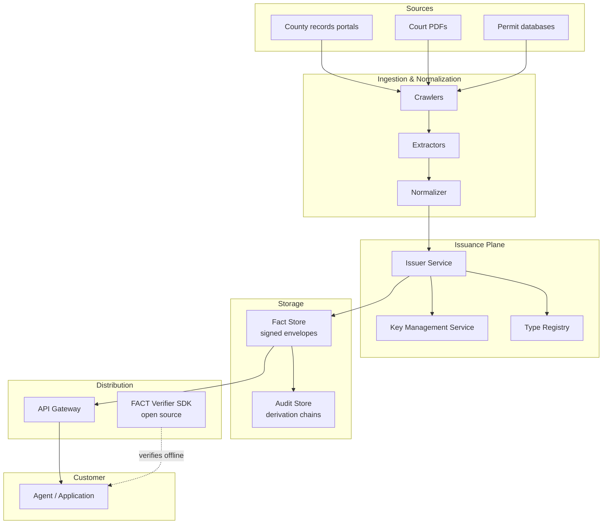
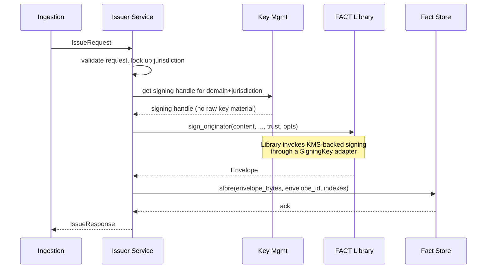
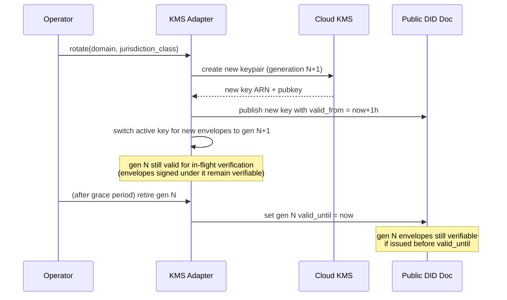

# FACT Protocol — Low-Level Design

**Companion to:** FACT Protocol HLD v0.2
**Status:** Draft
**Scope:** Two layers. **Part A** is the protocol library — modules, interfaces, and algorithms any conformant implementation must contain. **Part B** is the Skope production system — issuer service, key management, ingestion pipeline, verifier SDK, observability — built on top of the protocol library.
**Audience:** Engineers implementing FACT or building production systems on it. Language-agnostic; pseudocode and interfaces translate to Python, TypeScript, Rust, or Go.

---

# Part A — Protocol Library LLD

## A1. Library Goals and Non-Goals

The protocol library is the canonical reference implementation. Other implementations exist (and should) but the reference defines correctness.

**Goals.**

- Implement FACT v0.2 conformance §12 in full.
- One function per protocol operation: `sign_originator`, `sign_relay`, `sign_processor`, `verify`.
- Pure, deterministic, side-effect-free core. I/O confined to two seams: key resolution and replay cache.
- Defensive by default — every input is validated before any cryptography runs.
- All errors map to the protocol's closed error taxonomy. No leaking implementation errors to callers.
- Easy to fuzz, easy to test, easy to audit.

**Non-Goals.**

- Transport. The library produces and consumes envelopes; how they move between parties is not the library's concern.
- Storage. Envelopes are bytes; persisting them is the caller's concern.
- Key generation or key management. The library _uses_ private keys to sign and public keys to verify; managing the keypair lifecycle is the caller's concern (and Part B's concern for Skope).
- Application policy. The library reports facts (valid, stale, originator, hops); the application decides act/verify/escalate.

---

## A2. Module Layout

The library is organized into ten modules with clear dependency direction (lower modules have no awareness of higher ones).

```
┌─────────────────────────────────────────────────────┐
│  api          (sign_originator, sign_relay, verify) │  Layer 5: public surface
├─────────────────────────────────────────────────────┤
│  chain        (chain construction & walking)        │  Layer 4: orchestration
├─────────────────────────────────────────────────────┤
│  envelope     (assembly, parsing, serialization)    │  Layer 3: composition
├─────────────────────────────────────────────────────┤
│  attestation  (sign one link, verify one link)      │  Layer 3
├─────────────────────────────────────────────────────┤
│  crypto       (Ed25519, SHA-256, suite registry)    │  Layer 2: primitives
├─────────────────────────────────────────────────────┤
│  canonical    (JCS canonicalization + NFC)          │  Layer 2
├─────────────────────────────────────────────────────┤
│  identity     (did:key, did:web, key rotation)      │  Layer 2
├─────────────────────────────────────────────────────┤
│  time         (parse, format, skew comparison)      │  Layer 1: foundations
├─────────────────────────────────────────────────────┤
│  errors       (ProtocolError, error codes)          │  Layer 1
├─────────────────────────────────────────────────────┤
│  types        (Envelope, Claim, Attestation, etc.)  │  Layer 1
└─────────────────────────────────────────────────────┘
```

**Dependency rule.** A module at layer N may depend on modules at layers < N, never on layers ≥ N. The graph is strictly acyclic. This is enforced by code review; in some languages it can be enforced by the build system (Rust crates, Go packages, Python `__init__.py` discipline).

---

## A3. `types` — Data Structures

The on-the-wire data model from HLD §4, expressed as language-agnostic record types. Implementations translate to dataclasses, structs, or classes depending on the language.

### A3.1 Core records

```
record Envelope:
    v:     String              # protocol version, MUST equal "fact/0.2"
    alg:   String              # suite identifier
    nonce: String              # b64url, exactly 22 chars (128 bits)
    claim: Claim
    chain: List<Attestation>   # length 1..16
    trust: Trust

record Claim:
    content:      JsonValue    # opaque to protocol; canonicalized for hashing
    content_type: String       # URI
    claim_hash:   String       # b64url(sha256(canonicalize(content)))

record Attestation:
    issuer:       String                  # DID or pubkey identifier
    key_id:       String                  # key instance identifier
    role:         Role                    # ORIGINATOR | RELAY | PROCESSOR
    asserts:      String                  # see HLD §4.3
    issued_at:    String                  # RFC 3339 with explicit timezone
    prev:         Optional<String>        # b64url(sha256(canonicalize(previous_attestation)))
    derives_from: Optional<String>        # claim_hash of source (PROCESSOR only)
    claim_hash:   String                  # MUST match Envelope.claim.claim_hash
    nonce:        String                  # MUST match Envelope.nonce
    evidence:     JsonObject              # arbitrary
    ext:          JsonObject              # extension namespace map
    signature:    String                  # b64url(sig over signing_body)

record Trust:
    actionability: Actionability          # ACT | VERIFY | ESCALATE
    coverage:      Float                  # 0.0..1.0
    fresh_until:   Optional<String>       # RFC 3339
    not_before:    Optional<String>       # RFC 3339
    reason:        String

enum Role:
    ORIGINATOR
    RELAY
    PROCESSOR

enum Actionability:
    ACT
    VERIFY
    ESCALATE
```

### A3.2 Result types

The verifier returns a structured result, never a boolean.

```
sealed type VerifyResult:
    Valid(report: VerifyReport)
    Invalid(error: ProtocolError)

record VerifyReport:
    originator:     String        # issuer identifier of chain[0]
    hops:           Int           # len(chain)
    trust_hint:     Actionability # echoed from Trust.actionability
    coverage:       Float
    stale:          Bool          # now > fresh_until + skew
    issuer_trusted: Bool          # from caller-provided trusted_issuers
    fresh_until:    Optional<String>
    nonce:          String        # for caller-side dedup
    chain_summary:  List<ChainHop>  # one per attestation, for audit

record ChainHop:
    issuer:    String
    key_id:    String
    role:      Role
    issued_at: String
```

### A3.3 Configuration types

```
record VerifyOptions:
    trusted_issuers:    Optional<Set<String>>     # null = no policy filter
    skew_tolerance:     Duration                  # default 300s
    seen_nonce_cache:   Optional<ReplayCache>     # null = no replay detection
    size_limits:        SizeLimits
    key_resolver:       KeyResolver
    clock:              Clock                     # injectable for tests

record SizeLimits:
    envelope_max_bytes: Int    # default 2 MiB
    claim_max_bytes:    Int    # default 1 MiB (HLD §4.2)
    chain_max_hops:     Int    # default 16  (HLD §4.1)

record SignOptions:
    key:        PrivateKey      # opaque type; library does not own key material
    key_id:     String
    issuer:     String          # DID derived from key
    nonce:      Optional<String> # null = generate fresh (only valid for ORIGINATOR)
    issued_at:  Optional<String> # null = clock.now() (overridable for tests)
    suite:      String          # default "ed25519-sha256-jcs"
```

### A3.4 Invariants enforced by constructors

Wherever the language allows it, construction MUST enforce:

- `Envelope.nonce`, `Attestation.nonce` are 22-character b64url (decoded length = 16 bytes)
- `Envelope.chain` has 1..N entries where N = `size_limits.chain_max_hops`
- `Envelope.v` matches the implementation's known versions
- `Attestation.signature`, `Attestation.claim_hash`, `Attestation.prev` are b64url-shaped
- `issued_at`, `fresh_until`, `not_before` parse as RFC 3339 with explicit timezone
- `claim_hash` length = 43 chars (sha256 → 32 bytes → 43 b64url chars)

Violations raise `ProtocolError(MALFORMED)` at construction time, before any other code sees the record.

---

## A4. `errors` — Closed Error Taxonomy

```
record ProtocolError:
    code:    ErrorCode
    context: String              # human-readable detail; never trusted for control flow
    cursor:  Optional<Int>       # chain index where the error occurred, if applicable

enum ErrorCode:
    UNSUPPORTED_VERSION
    UNSUPPORTED_ALG
    MALFORMED
    SIZE_LIMIT_EXCEEDED
    CHAIN_TOO_LONG
    HASH_MISMATCH
    BROKEN_CHAIN
    CLAIM_MISMATCH
    NONCE_MISMATCH
    UNKNOWN_ISSUER
    KEY_REVOKED
    KEY_EXPIRED
    BAD_SIGNATURE
    REPLAY_DETECTED
    NOT_YET_VALID
```

**Discipline.** The library raises `ProtocolError` and only `ProtocolError`. Crypto-library exceptions, JSON-parse errors, and I/O errors are caught at module boundaries and translated into the appropriate `ErrorCode`. Callers should never see a stack trace from `libsodium` or `nacl`; they should see `ProtocolError(BAD_SIGNATURE)`.

**Error context.** The `context` field is for debugging, not control flow. Examples: `"attestation[2].signature: bad length 63, expected 86"`, `"claim_hash: expected dGVz... got Y2F0..."`. The cursor (`chain[i]`) is set for errors that occur inside the loop.

**Why a closed taxonomy.** Open error sets force callers to write defensive code for unknown failures. A closed set means every error has a defined receiver behavior (HLD §9 table) and verifiers can be tested exhaustively for it.

---

## A5. `time` — Timestamps and Skew

A thin wrapper around the host's time library to centralize all timestamp handling. Three reasons to put this in its own module: testability (inject a fake clock), correctness (one canonical parser), and consistency (one canonical formatter).

### A5.1 Interface

```
interface Clock:
    now() -> Instant
    # returns current time as an Instant (UTC internally)

function parse_rfc3339(s: String) -> Result<Instant, ProtocolError>:
    # MUST reject timestamps without explicit timezone
    # MUST accept "Z" and "±HH:MM"
    # MUST handle fractional seconds (up to nanosecond precision)
    # On any failure: ProtocolError(MALFORMED, "issued_at: <reason>")

function format_rfc3339(t: Instant) -> String:
    # MUST emit "Z" suffix for UTC
    # MUST emit fractional seconds only if non-zero
    # MUST emit shortest valid representation

function compare_with_skew(t: Instant, threshold: Instant, skew: Duration, direction: SkewDirection) -> Bool:
    # direction = BEFORE: returns (t < threshold - skew)
    # direction = AFTER:  returns (t > threshold + skew)
    # The skew tolerance moves the threshold, not the value
```

### A5.2 Why naive timestamps are rejected

A timestamp like `2026-05-27T12:00:00` is ambiguous — UTC or local? Different parsers assume different things. Rejecting at parse time eliminates an entire class of cross-implementation bugs. The HLD requires this; the LLD enforces it at the single point where timestamps enter the system.

---

## A6. `canonical` — JCS Canonicalization

The single highest-risk module. Implementations SHOULD use a vetted JCS library if one exists for the language; SHOULD NOT roll their own.

### A6.1 Interface

```
function canonicalize(value: JsonValue) -> Bytes:
    # Returns RFC 8785 canonical bytes
    # On unsupported value (NaN, Infinity, duplicate keys): ProtocolError(MALFORMED)

function nfc_normalize(s: String) -> String:
    # Unicode NFC normalization
    # MUST be applied to all string content before passing to canonicalize
    # (Caller responsibility, but this module provides the helper)
```

### A6.2 Implementation requirements

A conformant `canonical` module MUST handle every case in HLD §5.3:

| Concern               | Rule                                                  |
| --------------------- | ----------------------------------------------------- |
| Object key order      | Sort by UTF-16 code unit                              |
| Whitespace            | None outside string values                            |
| Numbers               | RFC 8785 §3.2.2.3 shortest round-trip form            |
| `1` vs `1.0`          | Distinct (former emits `1`, latter emits `1`)         |
| `-0`                  | Emits as `0`                                          |
| NaN, Infinity         | REJECT before serialization                           |
| Duplicate keys        | REJECT at parse or canonicalize time                  |
| Null vs absent        | Distinct; null emitted, absent omitted                |
| Unicode normalization | NOT applied by canonicalizer; caller's responsibility |
| BOM                   | NEVER emit                                            |
| Encoding              | UTF-8, no BOM                                         |

### A6.3 Testing

The conformance suite (§A11) ships ~60 canonicalization vectors covering every rule above. A `canonical` implementation that doesn't pass them ALL fails the entire library — every other module depends on this one being byte-exact.

### A6.4 Two patterns: live and frozen

There are two valid ways to integrate canonicalization with signing/verification:

**Live (re-canonicalize on verify).** Verifier parses the envelope JSON, re-canonicalizes for hashing. Conceptually clean. Requires `canonical` to be deterministic across implementations.

**Frozen (sign the bytes).** Issuer canonicalizes once at sign time and emits those exact bytes as the wire envelope. Verifier hashes the literal bytes received without re-parsing. Cheaper, less canonicalization fragility. RECOMMENDED for production.

The library supports both. Internal representation is structured (typed records); the frozen-bytes path is exposed via `envelope.to_canonical_bytes()` and `envelope.from_canonical_bytes()`.

---

## A7. `crypto` — Signatures and Hashing

### A7.1 Suite Registry

```
record CryptoSuite:
    identifier: String                 # e.g. "ed25519-sha256-jcs"
    sign:       function (key, bytes) -> Bytes
    verify:     function (pubkey, bytes, signature) -> Bool
    hash:       function (bytes) -> Bytes
    pubkey_len: Int                    # bytes
    sig_len:    Int                    # bytes

const SUITES: Map<String, CryptoSuite> = {
    "ed25519-sha256-jcs": CryptoSuite{
        identifier: "ed25519-sha256-jcs",
        sign:       libsodium.crypto_sign_detached,
        verify:     libsodium.crypto_sign_verify_detached,
        hash:       hashlib.sha256,
        pubkey_len: 32,
        sig_len:    64,
    },
    # Reserved suites (HLD §6.1) are absent until activated.
}

function get_suite(id: String) -> CryptoSuite:
    if id not in SUITES:
        raise ProtocolError(UNSUPPORTED_ALG, context: id)
    return SUITES[id]
```

**Discipline.** Implementations MUST NOT silently fall back to a different suite when the requested one is missing. Unknown algorithm → hard error.

### A7.2 Side-channel notes

- Signature verification MUST use the crypto library's constant-time comparison. Equality checks on hashes/signatures via plain `==` are acceptable for non-secret values; for any comparison involving secret-derived values, use `constant_time_eq`.
- Random nonces MUST use the OS CSPRNG (`os.urandom`, `crypto.randomBytes`, `getrandom`). Math.random and language-default RNGs are FORBIDDEN.

### A7.3 Helpers

```
function b64url_encode(b: Bytes) -> String:
    # No padding ('='), URL-safe alphabet
function b64url_decode(s: String) -> Bytes:
    # Strict: reject non-canonical encodings, reject padding, reject extra chars
function sha256(b: Bytes) -> Bytes
function fresh_nonce() -> String:
    # 16 random bytes from CSPRNG, b64url encoded
```

---

## A8. `identity` — DIDs and Key Resolution

### A8.1 Resolver interface

```
interface KeyResolver:
    resolve(issuer: String, key_id: String) -> Result<KeyRecord, ProtocolError>

record KeyRecord:
    public_key:   Bytes
    valid_from:   Optional<Instant>
    valid_until:  Optional<Instant>
    revoked_at:   Optional<Instant>
    revoked_retroactive: Bool        # default false
    suite:        String             # for verifying signature with right algorithm
```

### A8.2 Standard resolvers

**`DidKeyResolver`** — fully offline. The identifier `did:key:<multibase>` decodes directly to a public key. No `valid_from`/`valid_until`/`revoked_at` — keys are static, so rotation is "issue a new DID and migrate." `key_id` for `did:key` is conventionally the multibase suffix; resolvers MAY ignore `key_id` if it matches the DID.

```
class DidKeyResolver implements KeyResolver:
    resolve(issuer, key_id):
        if not issuer.starts_with("did:key:"):
            return UNKNOWN_ISSUER
        try:
            multibase = issuer.removeprefix("did:key:")
            key_bytes = multibase_decode(multibase)
            return KeyRecord(
                public_key: key_bytes,
                valid_from: null, valid_until: null, revoked_at: null,
                suite: infer_suite_from_multicodec(key_bytes)
            )
        except: return UNKNOWN_ISSUER
```

**`DidWebResolver`** — cached online. The identifier `did:web:<domain>` resolves to `https://<domain>/.well-known/did.json`. The document contains keys with their lifecycle metadata. The resolver caches by (domain, key_id) with a TTL and serves stale on resolver failure (degrade-but-don't-fail).

```
class DidWebResolver implements KeyResolver:
    field cache: LRUCache<(String, String), CachedKey>
    field http:  HttpClient
    field ttl:   Duration = 1 hour
    field stale_serve: Duration = 24 hours    # serve stale this long on fetch failure

    resolve(issuer, key_id):
        if not issuer.starts_with("did:web:"):
            return UNKNOWN_ISSUER

        cached = self.cache.get((issuer, key_id))
        if cached and not cached.expired(self.ttl):
            return cached.record

        try:
            doc = self.http.get(did_web_url(issuer))
            record = extract_key(doc, key_id)
            if record:
                self.cache.put((issuer, key_id), CachedKey(record, now()))
            return record or UNKNOWN_ISSUER
        except HttpError:
            if cached and not cached.expired(self.stale_serve):
                return cached.record
            return UNKNOWN_ISSUER
```

**`CompositeResolver`** — dispatches based on identifier scheme.

```
class CompositeResolver implements KeyResolver:
    field resolvers: List<KeyResolver>
    resolve(issuer, key_id):
        for r in self.resolvers:
            result = r.resolve(issuer, key_id)
            if result is not UNKNOWN_ISSUER:
                return result
        return UNKNOWN_ISSUER
```

### A8.3 Trust state semantics

The resolver returns lifecycle metadata; the _verifier_ applies it. Specifically, the verifier checks (HLD §7.3):

- `att.issued_at >= valid_from` (if set)
- `att.issued_at <= valid_until` (if set) → otherwise `KEY_EXPIRED`
- `att.issued_at < revoked_at` (if set) → otherwise `KEY_REVOKED`
- If `revoked_retroactive == true`, all signatures from this key are rejected regardless of date.

Splitting "resolve key" from "evaluate key state" makes both testable in isolation.

---

## A9. `attestation` and `chain` — Sign and Verify One/Many

### A9.1 `attestation`

Signs a single link, verifies a single link. No knowledge of chain structure.

```
function build_signing_body(att: Attestation) -> JsonObject:
    # Returns the attestation as a dict, with `signature` field removed.
    return att.to_dict().remove("signature")

function sign_attestation(att_partial: AttestationPartial, key: PrivateKey, suite: CryptoSuite) -> Attestation:
    body = build_signing_body(att_partial.with_empty_signature())
    body_bytes = canonicalize(body)
    sig = suite.sign(key, body_bytes)
    return att_partial.with_signature(b64url_encode(sig))

function verify_attestation_signature(att: Attestation, pubkey: Bytes, suite: CryptoSuite) -> Result<(), ProtocolError>:
    body = build_signing_body(att)
    body_bytes = canonicalize(body)
    sig_bytes = b64url_decode(att.signature)
    if len(sig_bytes) != suite.sig_len:
        return ProtocolError(BAD_SIGNATURE, "signature length")
    if not suite.verify(pubkey, body_bytes, sig_bytes):
        return ProtocolError(BAD_SIGNATURE, "signature verification failed")
    return Ok
```

### A9.2 `chain`

Knows about ordering, back-references, and role rules.

```
function compute_prev_hash(att: Attestation) -> String:
    return b64url_encode(sha256(canonicalize(att.to_dict())))

function append_relay(env: Envelope, key: PrivateKey, opts: SignOptions) -> Envelope:
    prev = env.chain[-1]
    prev_hash = compute_prev_hash(prev)

    att = AttestationPartial(
        issuer:       opts.issuer,
        key_id:       opts.key_id,
        role:         RELAY,
        asserts:      "relayed_unchanged",
        issued_at:    opts.issued_at or format_rfc3339(opts.clock.now()),
        prev:         prev_hash,
        derives_from: null,
        claim_hash:   env.claim.claim_hash,
        nonce:        env.nonce,
        evidence:     {},
        ext:          {},
    )
    signed = sign_attestation(att, key, get_suite(opts.suite))
    return env.with_chain(env.chain + [signed])

function append_processor(env: Envelope, new_claim: Claim, key: PrivateKey, opts: SignOptions) -> Envelope:
    # A PROCESSOR produces a NEW envelope with a NEW claim. The new chain starts fresh,
    # but the first attestation references the original via derives_from.
    prev_hash = null
    nonce = opts.nonce or fresh_nonce()

    att = AttestationPartial(
        role:         PROCESSOR,
        asserts:      "derives_from",
        derives_from: env.claim.claim_hash,
        claim_hash:   new_claim.claim_hash,
        nonce:        nonce,
        ...rest similar...
    )
    signed = sign_attestation(att, key, get_suite(opts.suite))
    return Envelope(
        v: "fact/0.2", alg: opts.suite,
        nonce: nonce, claim: new_claim,
        chain: [signed], trust: ...
    )
```

### A9.3 Chain verification loop

The heart of the library. Mirrors HLD §8.3 step-for-step.

```
function verify_chain(env: Envelope, opts: VerifyOptions) -> Result<(), ProtocolError>:
    suite = get_suite(env.alg)
    prev_hash = null

    for i, att in enumerate(env.chain):
        # Structural rules
        if i == 0:
            if att.prev != null:
                return ProtocolError(MALFORMED, "originator must have prev=null", cursor: i)
            if att.role != ORIGINATOR:
                return ProtocolError(MALFORMED, "first link must be ORIGINATOR", cursor: i)
        else:
            if att.prev != prev_hash:
                return ProtocolError(BROKEN_CHAIN, cursor: i)

        # Required binding fields
        if att.claim_hash != env.claim.claim_hash:
            return ProtocolError(CLAIM_MISMATCH, cursor: i)
        if att.nonce != env.nonce:
            return ProtocolError(NONCE_MISMATCH, cursor: i)

        # Timestamp shape (must include timezone)
        att_time = parse_rfc3339(att.issued_at)
        if att_time is Error:
            return att_time.error.with_cursor(i)

        # Key resolution and state
        record = opts.key_resolver.resolve(att.issuer, att.key_id)
        if record is Error or record is UNKNOWN_ISSUER:
            return ProtocolError(UNKNOWN_ISSUER, cursor: i)

        if record.revoked_retroactive:
            return ProtocolError(KEY_REVOKED, cursor: i)
        if record.revoked_at is not null and att_time >= record.revoked_at:
            return ProtocolError(KEY_REVOKED, cursor: i)
        if record.valid_until is not null and att_time > record.valid_until:
            return ProtocolError(KEY_EXPIRED, cursor: i)
        if record.valid_from is not null and att_time < record.valid_from:
            return ProtocolError(KEY_EXPIRED, "issued before valid_from", cursor: i)

        # Signature
        result = verify_attestation_signature(att, record.public_key, suite)
        if result is Error:
            return result.with_cursor(i)

        prev_hash = compute_prev_hash(att)

    return Ok
```

---

## A10. `envelope` and `api` — Composition and Public Surface

### A10.1 `envelope`

Serialization and structural validation only. No crypto here.

```
function serialize(env: Envelope) -> Bytes:
    return canonicalize(env.to_dict())
    # Frozen-bytes pattern: serialize ONCE; transmit these bytes.

function deserialize(bytes: Bytes) -> Result<Envelope, ProtocolError>:
    try:
        parsed = parse_json(bytes)
    except JsonError as e:
        return ProtocolError(MALFORMED, "json parse: " + e.message)

    # Structural validation runs in the typed constructor; any failure → MALFORMED
    try:
        return Envelope.from_dict(parsed)
    except ValidationError as e:
        return ProtocolError(MALFORMED, e.detail)
```

### A10.2 `api`

The public surface. Three sign functions, one verify function. Everything else is internal.

```
# ---- Signing ----

function sign_originator(
    content:      JsonValue,
    content_type: String,
    trust:        Trust,
    evidence:     JsonObject,
    opts:         SignOptions,
) -> Envelope:
    # Caller normalizes string content to NFC if it contains user strings;
    # the library does not guess.
    canonical_claim = canonicalize(content)
    claim_hash = b64url_encode(sha256(canonical_claim))
    claim = Claim(content, content_type, claim_hash)

    nonce = opts.nonce or fresh_nonce()
    att = AttestationPartial(
        issuer:       opts.issuer,
        key_id:       opts.key_id,
        role:         ORIGINATOR,
        asserts:      "true_as_of",
        issued_at:    opts.issued_at or format_rfc3339(opts.clock.now()),
        prev:         null,
        derives_from: null,
        claim_hash:   claim_hash,
        nonce:        nonce,
        evidence:     evidence,
        ext:          {},
    )
    signed = sign_attestation(att, opts.key, get_suite(opts.suite))

    return Envelope(
        v: "fact/0.2", alg: opts.suite,
        nonce: nonce, claim: claim,
        chain: [signed], trust: trust,
    )

function sign_relay(env: Envelope, opts: SignOptions) -> Envelope:
    # Pre-condition: caller MUST have verified `env` before relaying.
    # The library does NOT re-verify automatically — that would be a hidden cost
    # and would prevent legitimate uses (e.g. forwarding without trust).
    return append_relay(env, opts.key, opts)

function sign_processor(env: Envelope, new_content: JsonValue, new_content_type: String,
                         new_trust: Trust, evidence: JsonObject, opts: SignOptions) -> Envelope:
    # Same pre-condition. Produces a NEW envelope; the original is unchanged.
    canonical_claim = canonicalize(new_content)
    claim_hash = b64url_encode(sha256(canonical_claim))
    new_claim = Claim(new_content, new_content_type, claim_hash)
    return append_processor(env, new_claim, opts.key, opts).with_trust(new_trust)

# ---- Verifying ----

function verify(env: Envelope, opts: VerifyOptions) -> VerifyResult:
    # 1. Static limits FIRST (DoS protection before crypto)
    if size_of(env) > opts.size_limits.envelope_max_bytes:
        return Invalid(ProtocolError(SIZE_LIMIT_EXCEEDED, "envelope"))
    if size_of(env.claim.content) > opts.size_limits.claim_max_bytes:
        return Invalid(ProtocolError(SIZE_LIMIT_EXCEEDED, "claim"))
    if len(env.chain) > opts.size_limits.chain_max_hops:
        return Invalid(ProtocolError(CHAIN_TOO_LONG))
    if len(env.chain) == 0:
        return Invalid(ProtocolError(MALFORMED, "empty chain"))

    # 2. Version + suite
    if not is_supported_version(env.v):
        return Invalid(ProtocolError(UNSUPPORTED_VERSION, env.v))
    if env.alg not in SUITES:
        return Invalid(ProtocolError(UNSUPPORTED_ALG, env.alg))

    # 3. Nonce shape
    if not is_valid_nonce_shape(env.nonce):
        return Invalid(ProtocolError(MALFORMED, "nonce shape"))

    # 4. Replay check BEFORE crypto (cheap; protects from crypto-DoS via repeated invalid envelopes)
    if opts.seen_nonce_cache is not null:
        if opts.seen_nonce_cache.contains(env.nonce):
            return Invalid(ProtocolError(REPLAY_DETECTED))

    # 5. Content integrity — recompute
    recomputed = b64url_encode(sha256(canonicalize(env.claim.content)))
    if recomputed != env.claim.claim_hash:
        return Invalid(ProtocolError(HASH_MISMATCH))

    # 6. Walk the chain (signatures, key state, structural rules)
    chain_result = verify_chain(env, opts)
    if chain_result is Error:
        return Invalid(chain_result.error)

    # 7. Temporal validity
    now = opts.clock.now()
    skew = opts.skew_tolerance
    if env.trust.not_before is not null:
        nb = parse_rfc3339(env.trust.not_before)
        if compare_with_skew(now, nb, skew, BEFORE):
            return Invalid(ProtocolError(NOT_YET_VALID))

    stale = false
    if env.trust.fresh_until is not null:
        fu = parse_rfc3339(env.trust.fresh_until)
        stale = compare_with_skew(now, fu, skew, AFTER)

    # 8. Issuer trust policy
    originator = env.chain[0].issuer
    issuer_trusted = (opts.trusted_issuers is null) or (originator in opts.trusted_issuers)

    # 9. Commit nonce to cache (ONLY after full success — failures don't consume slots)
    if opts.seen_nonce_cache is not null:
        opts.seen_nonce_cache.insert(env.nonce, env.trust.fresh_until)

    return Valid(VerifyReport(
        originator:     originator,
        hops:           len(env.chain),
        trust_hint:     env.trust.actionability,
        coverage:       env.trust.coverage,
        stale:          stale,
        issuer_trusted: issuer_trusted,
        fresh_until:    env.trust.fresh_until,
        nonce:          env.nonce,
        chain_summary:  [ChainHop.from(a) for a in env.chain],
    ))
```

### A10.3 The replay cache interface

```
interface ReplayCache:
    contains(nonce: String) -> Bool
    insert(nonce: String, fresh_until: Optional<String>) -> ()
    # Implementations evict on TTL = fresh_until (default 24h) and bounded by size

class InMemoryReplayCache implements ReplayCache:
    field entries: TimedLRU<String, Instant>
    field max_size: Int = 100_000
    field default_ttl: Duration = 24 hours

class RedisReplayCache implements ReplayCache:
    field redis: RedisClient
    field key_prefix: String
    # contains: EXISTS prefix:<nonce>
    # insert:   SET prefix:<nonce> "" EX <ttl_seconds> NX
```

Two implementations ship by default. Production deployments use the Redis variant for cross-instance dedup; tests and small deployments use in-memory.

---

## A11. Test Strategy

### A11.1 Test categories

| Category                  | Purpose                                         | Count target |
| ------------------------- | ----------------------------------------------- | ------------ |
| Unit (per-module)         | Each function correct in isolation              | 200+         |
| Canonicalization vectors  | RFC 8785 conformance                            | 60+          |
| Positive protocol vectors | Valid envelopes verify                          | 30+          |
| Negative protocol vectors | Invalid envelopes rejected with the right error | 50+          |
| Cross-version vectors     | v0.1 envelopes against v0.2 verifier            | 10+          |
| Property-based            | Roundtrip, structural invariants                | continuous   |
| Fuzz                      | Malformed inputs do not crash, panic, or hang   | continuous   |
| Interop                   | Cross-implementation against TS / Python / Rust | per-suite    |

### A11.2 Canonicalization vectors (sample)

Format: `(input_json, expected_canonical_bytes)`. Implementations MUST produce the exact expected bytes.

```
{ "b": 2, "a": 1 }              → {"a":1,"b":2}
{ "x": 1.0 }                    → {"x":1}
{ "x": -0 }                     → {"x":0}
{ "k": null }                   → {"k":null}
{}                              → {}
{ "u": "café" }   (precomposed) → {"u":"café"}   (only if NFC applied)
{ "u": "cafe\u0301" } (decomp)  → REJECT unless caller NFC-normalized

# Duplicate keys MUST reject:
{ "k": 1, "k": 2 }              → ProtocolError(MALFORMED, "duplicate key")
```

### A11.3 Negative vectors (sample)

Each negative vector is an envelope + the exact `ErrorCode` a conformant verifier MUST return.

```
vec_neg_001:
  description: tampered claim, signatures intact
  envelope: { ...valid signatures..., claim.content modified post-sign }
  expected: HASH_MISMATCH

vec_neg_002:
  description: chain[1].prev points to wrong hash
  expected: BROKEN_CHAIN at cursor=1

vec_neg_003:
  description: nonce mismatch between envelope and chain[2]
  expected: NONCE_MISMATCH at cursor=2

vec_neg_004:
  description: issuer key revoked before attestation date
  expected: KEY_REVOKED at cursor=0

vec_neg_005:
  description: naive timestamp "2026-05-27T12:00:00"
  expected: MALFORMED

vec_neg_006:
  description: chain length 17
  expected: CHAIN_TOO_LONG

vec_neg_007:
  description: same envelope verified twice with shared cache
  expected: REPLAY_DETECTED on second call
```

### A11.4 Property-based properties

```
property: round-trip serialization
  for any envelope E:
    deserialize(serialize(E)) == E

property: signature stability
  for any (claim, key, nonce, issued_at):
    sign_originator(...) yields identical signature bytes given identical inputs

property: chain extension preserves originator
  for any E, key:
    verify(append_relay(E, key)).originator == verify(E).originator

property: tamper detection
  for any valid E, any byte mutation M:
    if M changes any byte of E, then verify(M(E)).is_invalid

property: nonce uniqueness
  for any 10000 calls to fresh_nonce():
    all results are distinct (probabilistic, but Pr ≈ 2^-100 at this scale)
```

### A11.5 Fuzz targets

```
fuzz_target deserialize:  random bytes → must return ProtocolError(MALFORMED), never panic
fuzz_target verify:       random bytes → must return Invalid(...), never panic, never network call
fuzz_target canonicalize: random JsonValue → must terminate, must produce stable bytes for stable input
```

Fuzz harnesses run in CI for a fixed time budget per PR (e.g. 60 seconds per target) and an unbounded budget nightly.

### A11.6 Interop CI

A meta-suite that runs the same vector against every implementation and asserts identical pass/fail results. This is what guarantees ecosystem coherence — without it, "conformant" is hand-wavy.

```
for vec in all_vectors:
    results = [impl.verify(vec) for impl in {python, typescript, rust, go}]
    assert all_equal(results), f"Disagreement on {vec.id}: {results}"
```

---

## A12. Performance Targets

Order-of-magnitude budgets for typical inputs (1 KB claim, 1-hop chain), on commodity hardware. These aren't HLD requirements; they're sanity checks for the reference implementation.

| Operation                           | Target  | Why                                   |
| ----------------------------------- | ------- | ------------------------------------- |
| `sign_originator`                   | < 1 ms  | One canonicalize + one Ed25519 sign   |
| `verify` (1 hop)                    | < 1 ms  | One canonicalize + one Ed25519 verify |
| `verify` (3 hops)                   | < 3 ms  | Linear in hops                        |
| `verify` (16 hops)                  | < 20 ms | Bounded by chain limit                |
| Replay-cache `contains` (in-memory) | < 1 µs  | Hash table lookup                     |
| Replay-cache `contains` (Redis)     | < 5 ms  | Network RTT bounded                   |

An agent making thousands of decisions per second can afford one verify per decision.

---

# Part B — Skope System LLD

Part A is the protocol. Part B is what Skope builds _on_ it to issue, distribute, and operate FACT envelopes at production scale. Everything here is Skope-specific and not part of the FACT spec.

## B1. System Overview



The system has four planes:

- **Ingestion** turns raw sources into structured facts.
- **Issuance** signs those facts into FACT envelopes.
- **Distribution** serves envelopes to customers.
- **Verification** happens client-side, in the customer's agent, using our open SDK — by design we are NOT in the verification path.

The asymmetry is the whole point: we run a lot of infrastructure to _produce_ envelopes; we operate zero infrastructure to _verify_ them. That's what makes the protocol open.

---

## B2. Issuer Service

The core writeable surface of the system. Receives normalized facts from ingestion, signs them, persists them.

### B2.1 Responsibilities

- Accept normalized facts from the ingestion pipeline.
- Look up the right signing key for the (domain, jurisdiction) tuple.
- Compute trust block (actionability, coverage, fresh_until).
- Sign via the protocol library (Part A).
- Persist the signed envelope in the fact store with indexes for retrieval.
- Emit metrics: facts issued, signature errors, key usage by key_id.

### B2.2 Interface

```
service Issuer:
    rpc Issue(IssueRequest) -> IssueResponse

record IssueRequest:
    domain:          String         # e.g. "code_enforcement"
    jurisdiction_id: String         # canonical ID (see B6)
    content:         JsonValue      # the normalized fact
    content_type:    String         # URI into the type registry
    source_evidence: Evidence       # what underlying source this came from
    freshness:       Duration       # how long the issuer vouches for this fact
    actionability:   Actionability  # computed by the ingestion layer
    coverage:        Float          # computed from the jurisdiction's coverage model

record IssueResponse:
    envelope:        Envelope       # the signed result
    envelope_bytes:  Bytes          # canonical bytes for storage
    envelope_id:     String         # = b64url(sha256(envelope_bytes)), for indexing
```

### B2.3 Sequence



### B2.4 The signing-key abstraction

The FACT library's `PrivateKey` is opaque. In Skope, it's never raw bytes in process memory — it's a handle that delegates to KMS. This is a critical security boundary.

```
class KmsSigningKey implements PrivateKey:
    field kms_client: KmsClient
    field key_arn:    String
    field key_id:     String     # the FACT-level key_id, separate from KMS ARN

    sign(bytes: Bytes) -> Bytes:
        # KMS sign request; private key never leaves the HSM
        return self.kms_client.sign(self.key_arn, bytes, alg: "Ed25519")

    pubkey_id() -> String:
        # Returns the FACT issuer identifier, NOT the KMS ARN
        return f"did:web:skope.io"

    key_id_str() -> String:
        return self.key_id
```

The library's `sign_attestation()` calls `key.sign(bytes)`, which under the hood is a network call to AWS KMS, Google Cloud KMS, or HashiCorp Vault. Latency is added; security is dramatically improved.

### B2.5 Hot path performance budget

| Step                   | Budget      | Note                             |
| ---------------------- | ----------- | -------------------------------- |
| Request validate       | 0.5 ms      |                                  |
| Jurisdiction lookup    | 1 ms        | Cached, occasional DB hit        |
| KMS signing key lookup | 0.1 ms      | Cached                           |
| Canonicalize claim     | 0.5 ms      |                                  |
| KMS sign call          | 30–80 ms    | Network bound; the dominant cost |
| Fact store insert      | 5 ms        |                                  |
| **Total**              | **~100 ms** | Per fact at p50                  |

At target throughput of 1000 facts/sec, this requires ~100 in-flight KMS signs at any time. Use a connection pool and pipelined requests.

---

## B3. Key Management Service

### B3.1 Architecture

```
┌─────────────────────────────────────┐
│  Issuer Service                     │
└──────────┬──────────────────────────┘
           │ signing requests
           ↓
┌─────────────────────────────────────┐
│  KMS Adapter Layer                  │  <- Skope's wrapper
│  - Per-domain key routing           │
│  - Key rotation orchestration       │
│  - Public-key publication           │
└──────────┬──────────────────────────┘
           ↓
┌─────────────────────────────────────┐
│  Cloud KMS / HSM                    │  <- Vendor (AWS/GCP/Vault)
│  - Stores private keys              │
│  - Performs Ed25519 signing         │
│  - Audit logs                       │
└─────────────────────────────────────┘
```

We use cloud KMS as the actual key store (private keys never exist in process memory) and write a thin adapter that exposes a FACT-shaped interface.

### B3.2 Key naming scheme

```
skope-fact-{domain}-{jurisdiction_class}-{generation}

examples:
  skope-fact-codeenf-municipal-2026q2
  skope-fact-evict-county-2026q2
  skope-fact-permit-state-2026q2
```

Per (domain, jurisdiction-class) keying lets us:

- Rotate one domain without disturbing others.
- Distinct revocation blast radius per domain.
- Map keys to operational owners.

`{generation}` is the rotation epoch. New generation every 90 days (planned rotation) or immediately (on compromise).

### B3.3 Key rotation flow



The DID document at `https://skope.io/.well-known/did.json` is the public source of truth for which keys we operate. It is updated atomically (key publishes happen via an idempotent CI deploy).

### B3.4 Compromise response

If a key is suspected compromised:

1. Operator triggers `revoke(key_id, retroactive=false)`.
2. KMS adapter writes `revoked_at: <now>` to the DID doc.
3. CDN caches purge.
4. Verifiers refreshing the DID doc see the revocation and reject signatures dated after `revoked_at`.
5. Issuer service rotates to a new key for that (domain, jurisdiction-class).

If signatures dated before `revoked_at` should also be invalidated (e.g., we suspect the key was compromised earlier than detected):

1. Operator triggers `revoke(key_id, retroactive=true)`.
2. All envelopes signed by that key, regardless of date, are rejected.
3. Re-issuance is triggered for the affected fact set.

The default is `retroactive=false`: past attestations remain valid unless we have specific reason to believe they were created by the attacker.

---

## B4. Ingestion and Normalization

### B4.1 Pipeline shape

```
[Source crawlers] → [Raw store] → [Extractors] → [Normalizer] → [Issuer]
       ↓
   per-source
   reliability
   ↓ feeds into
   trust block
```

### B4.2 Extractor contract

Each source has a dedicated extractor that produces a normalized fact. The extractor's output schema is governed by the domain's content type.

```
interface Extractor<DomainFact>:
    extract(raw: RawSource) -> Result<DomainFact, ExtractError>

    # Reliability metadata about THIS extraction run, used to compute
    # the actionability hint in the resulting envelope's Trust block.
    reliability(raw: RawSource, extracted: DomainFact) -> ReliabilitySignal

record ReliabilitySignal:
    confidence:        Float       # 0..1, extractor's own confidence
    source_freshness:  Duration    # how old the source data was at extraction
    coverage_class:    String      # COMPLETE | PARTIAL | UNKNOWN
```

### B4.3 Computing the trust block

```
function compute_trust(domain, jurisdiction, fact, reliability) -> Trust:
    actionability = ACT
    if reliability.confidence < 0.95:           actionability = VERIFY
    if reliability.coverage_class == "PARTIAL": actionability = VERIFY
    if reliability.confidence < 0.80:           actionability = ESCALATE
    if reliability.coverage_class == "UNKNOWN": actionability = ESCALATE

    coverage = jurisdiction_coverage(jurisdiction, domain)  # cached lookup
    fresh_until = now() + freshness_window(domain)

    return Trust(
        actionability: actionability,
        coverage:      coverage,
        fresh_until:   format_rfc3339(fresh_until),
        not_before:    null,
        reason:        explain(actionability, reliability),
    )
```

This is the protocol-meets-reality boundary: the protocol carries the trust block, but _how it's computed_ is Skope's product. Other issuers will compute it differently. The discipline is that we compute it conservatively — when in doubt, downgrade actionability.

### B4.4 Idempotency

Crawlers re-fetch sources on a schedule. The same fact may be extracted multiple times. The issuer service deduplicates by:

```
extraction_key = (domain, jurisdiction_id, source_uri, canonical_form(fact))
```

If `extraction_key` already exists and the previous envelope is still within its freshness window, no new envelope is issued. If freshness has expired, a new envelope is issued (with a new nonce, new timestamp, possibly new key generation).

---

## B5. Fact Store and Audit Store

### B5.1 Fact Store

Primary storage for issued envelopes. Optimized for:

- Lookup by (domain, jurisdiction, entity_id) — the customer query pattern.
- Lookup by envelope_id — for direct fetch.
- Range scan by issued_at — for freshness sweeps and re-issuance.

```
schema fact_store:
    envelope_id:     String   PRIMARY KEY  -- b64url(sha256(envelope_bytes))
    domain:          String   INDEXED
    jurisdiction_id: String   INDEXED
    entity_id:       String   INDEXED      -- domain-specific key into the fact
    claim_hash:      String   INDEXED      -- enables corroboration queries
    issued_at:       Timestamp INDEXED
    fresh_until:     Timestamp INDEXED
    key_id:          String   INDEXED      -- enables fast revocation sweep
    envelope_bytes:  Bytes                  -- canonical bytes, ready to ship
```

`envelope_bytes` is the canonical serialization — frozen at issuance, byte-stable, hash-verifiable. We never re-serialize; we ship what we signed.

### B5.2 Audit Store

A separate write-once log of every issuance event:

```
schema audit_store:
    audit_id:      UUID    PRIMARY KEY
    envelope_id:   String  INDEXED
    issued_at:     Timestamp
    issuer_key_id: String
    source_uri:    String          -- traceability to underlying source
    extractor_id:  String
    extractor_version: String
    reliability_signal: JsonObject
    operator:      String          -- service identity that requested issuance
```

The audit store is append-only and replicated. Forensic queries — "show me everything signed by key X" or "what extractor produced this envelope" — go here, not the fact store.

### B5.3 Derivation tracking

When a downstream processor produces a derived fact (via `sign_processor`), the audit store records the derivation edge:

```
schema derivation_edges:
    derived_envelope_id: String INDEXED
    source_envelope_id:  String INDEXED
    processor_issuer:    String
    processor_method:    String
    derived_at:          Timestamp
```

Walking edges backward recovers the full provenance tree to ground truth.

---

## B6. Type and Jurisdiction Registries

The protocol references `content_type` and issuer-published identities by URI. Skope operates the canonical type registry and the canonical jurisdiction registry for the domains we cover.

### B6.1 Content type registry

URI form: `fact://types/<domain>/<subtype>/<version>`

Example: `fact://types/code_enforcement/violation/v1`

Each type has a JSON Schema published at a stable URL. The schema defines the shape of `Claim.content` for that type. Schemas are versioned; v1 schemas never break.

```
schema type_registry_entry:
    type_uri:      String  PRIMARY KEY
    schema_url:    String          -- e.g. https://types.skope.io/code_enforcement/violation/v1.json
    schema_sha256: String          -- integrity check
    introduced:    Timestamp
    deprecated:    Optional<Timestamp>
    replaces:      Optional<String>  -- previous URI if this is a revision
```

### B6.2 Jurisdiction registry

The canonical naming for jurisdictions — the asset that makes Skope's corpus normalizable across 89,000 county-level entities.

URI form: `skope://jurisdictions/<country>/<state>/<county_or_city>[/<subunit>]`

Example: `skope://jurisdictions/us/il/cook_county`

```
schema jurisdiction_registry:
    jurisdiction_id: String PRIMARY KEY
    country:         String
    state:           String
    county:          Optional<String>
    city:            Optional<String>
    subunit:         Optional<String>
    aliases:         List<String>     -- alternate names seen in source data
    fips_code:       Optional<String> -- where applicable
    geo_polygon:     Optional<Geo>    -- for spatial queries
```

This is Part B's most valuable asset and most defensible artifact. The protocol can be open; the registry is the source of truth, and operating it (keeping aliases current, adding new jurisdictions, handling boundary changes) is real ongoing work that compounds into a moat.

---

## B7. Distribution

### B7.1 API Gateway

Customers query for envelopes by domain/jurisdiction/entity. The gateway is a thin layer over the fact store:

```
GET /v1/facts/{domain}/{jurisdiction_id}/{entity_id}
  → most recent fresh envelope for that entity

GET /v1/facts/by-id/{envelope_id}
  → specific envelope

GET /v1/facts/{domain}/{jurisdiction_id}?since={iso8601}
  → enumerate updates (for replication / sync)
```

Responses are the canonical envelope bytes, ready to be passed to the customer's verifier. We add no transport-layer envelope or proprietary wrapping; the customer sees exactly what we signed.

### B7.2 The verifier SDK (open source)

This is the artifact developers integrate. Per the protocol, it must run offline and require nothing from Skope at verify time.

```
package: @skope/fact-verifier  (also: skope-fact-verifier on PyPI, crates.io, Go module)
license: Apache-2.0
size: ~50 KB minified (TypeScript)

public API mirrors Part A's `api` module:
    verify(envelope) -> VerifyResult
    deserialize(bytes) -> Envelope | error

Bundled defaults:
    - Mandatory crypto suite (Ed25519+SHA-256+JCS)
    - did:key resolver (offline)
    - In-memory replay cache (configurable)
    - Skope's public DID doc cached at build time (so a fresh install works offline)
```

The SDK is the protocol's reference implementation, badged as Skope's. It's free, MIT/Apache, and we accept community PRs. This is the lever that compounds: every developer using it is a developer who can verify Skope-issued facts without ever calling our API.

### B7.3 Distribution math (why the asymmetry pays)

The customer call pattern is:

1. Customer fetches envelope from our API (1 network call to us).
2. Customer's agent calls `verify(envelope)` (0 network calls to us).
3. Agent makes a decision.

If a customer caches envelopes (which they should — envelopes are immutable until `fresh_until`), step 1 might happen once per envelope across many decisions. Our hot path is "issue once, serve once, verify many." That's classically infrastructure-shaped traffic.

---

## B8. Observability and Operations

### B8.1 Metrics

Per-service metrics, exposed via Prometheus/OpenTelemetry:

```
Issuer:
  fact_issued_total{domain, jurisdiction_class, actionability}
  fact_issue_latency_ms{quantile} histogram
  fact_issue_errors_total{reason}
  signing_key_usage{key_id} counter

KMS adapter:
  kms_sign_latency_ms{quantile, provider} histogram
  kms_sign_errors_total{reason, provider}
  key_rotation_events_total{domain, key_id, kind}

Fact store:
  fact_store_write_latency_ms{quantile}
  fact_store_read_latency_ms{quantile, query_type}

API gateway:
  api_requests_total{endpoint, status}
  api_request_latency_ms{quantile, endpoint}

Ingestion:
  extraction_runs_total{extractor_id, status}
  extraction_confidence{extractor_id} histogram
  coverage_class_distribution{domain, jurisdiction}
```

### B8.2 Alerts (operationally critical)

| Alert                      | Threshold                  | Why                                   |
| -------------------------- | -------------------------- | ------------------------------------- |
| Signing key error rate     | > 0.1% over 5 min          | KMS issue or rotation gone wrong      |
| Fact issuance backlog      | > 30 min                   | Ingestion outpacing issuance          |
| DID doc fetch errors       | any                        | Verifiers will lose trust             |
| Stale-envelope ratio       | > 10% in production sample | Re-issuance not keeping up            |
| Negative-vector regression | any CI failure             | Conformance regression — block deploy |

### B8.3 Audit and forensics

Every issued envelope is reconstructable from the audit store + the key history. A forensic query "did Skope ever sign this fact?" returns yes/no with the audit trail, regardless of whether the envelope is still in the fact store.

This matters for two reasons: legal defensibility (an autonomous decision made on a Skope fact must be defensible years later) and incident response (if a key is compromised, we need to enumerate exactly what it signed).

---

## B9. Failure Modes and Degradation

### B9.1 Single-component failures

| Component          | Failure            | Degradation strategy                                                                                             |
| ------------------ | ------------------ | ---------------------------------------------------------------------------------------------------------------- |
| KMS                | unreachable        | Issuer stops issuing for that domain; existing envelopes still serve from fact store; verifiers unaffected       |
| Fact store         | unreachable        | API gateway returns 503; ingestion buffers facts to retry                                                        |
| Ingestion crawlers | source unreachable | Re-fetch with backoff; freshness drops over time; trust block downgrades to VERIFY/ESCALATE on subsequent issues |
| DID doc CDN        | unreachable        | Verifiers serve stale (within 24h); after that, UNKNOWN_ISSUER                                                   |
| API gateway        | unreachable        | Customers serve cached envelopes; new envelopes unavailable                                                      |
| Type registry      | unreachable        | Customers' verifiers unaffected (URI is reference only); new content types delayed                               |

The bias is toward keeping verification working even when issuance is degraded. Customers who already have envelopes in hand can keep making decisions.

### B9.2 Whole-Skope failure

If Skope as a company goes dark — the API gateway is gone, the DID doc CDN is gone, our entire infrastructure is gone — what happens to envelopes in the wild?

- Envelopes signed under `did:key` issuers (rare for us; we mostly use `did:web:skope.io`): still verifiable, forever.
- Envelopes signed under `did:web:skope.io`: verifiable as long as the DID doc remains reachable somewhere. If the domain lapses, verifiers fail with `UNKNOWN_ISSUER` on cache miss.

To harden against this, we publish the DID doc to multiple anchors: the canonical `https://skope.io/.well-known/did.json`, a mirror on IPFS, and (long-term) a transparency log. Verifiers fall through these in order.

This is the "we can disappear and the protocol still works" property. It's what makes the verifier SDK genuinely safe to depend on.

---

## B10. Deployment Topology (rough)

```
Region 1 (primary)            Region 2 (warm standby)
├─ API gateway (autoscaled)   ├─ API gateway (warm)
├─ Issuer service (N pods)    ├─ Issuer service (idle)
├─ KMS (managed)              ├─ KMS (replicated)
├─ Fact store (primary)       ├─ Fact store (read replica)
├─ Audit store (primary)      ├─ Audit store (replica)
└─ Type/Juris registries      └─ Type/Juris registries

Globally distributed:
└─ DID doc CDN (CloudFront / Cloudflare)
└─ Verifier SDK CDN (npm / PyPI / etc.)
```

Failover from primary to standby: minutes for issuance, near-zero for serving (read replica + CDN keep envelopes available throughout).

---

## B11. Open Questions / v0.3 work in Part B

- **Multi-issuer corroboration.** When two independent issuers attest to the same fact, we want to surface that to the consumer ("3 of 3 issuers agree"). Requires a corroboration block (deferred in protocol §13) and a corroboration index in the fact store.
- **Transparency log.** Append-only log of all issued envelopes, so customers can audit that the envelope they received is the same one we published. Reduces equivocation risk.
- **Issuer federation.** Letting third parties (e.g., a state agency) become issuers under the same protocol, with Skope operating only the protocol governance rather than all the keys.
- **Selective disclosure.** Once the protocol supports it, expose field-level redaction so customers can prove "this property has no open violations" without revealing the property identifier.

---

# Appendix: Implementer's Quick Reference

For an engineer starting from this LLD:

1. **First week:** implement `types`, `errors`, `time`, `canonical`. Pass all canonicalization test vectors. Do not move forward until they pass.
2. **Second week:** implement `crypto` and `identity` (just `did:key`). Wire up `attestation.sign`/`verify`. Make a single-link envelope round-trip.
3. **Third week:** implement `chain`, `envelope`, `api`. Hit all positive protocol vectors.
4. **Fourth week:** implement negative-vector handling. Implement the replay cache (in-memory variant first). Hit all negative vectors with correct error codes.
5. **Fifth week:** fuzz harness, property tests, interop CI. Find and fix the bugs.

Then — and only then — start on Part B integration: KMS adapter, issuer service, fact store schemas. Building Part B before Part A is conformant and tested is the single most common way these projects ship something that "almost works."
